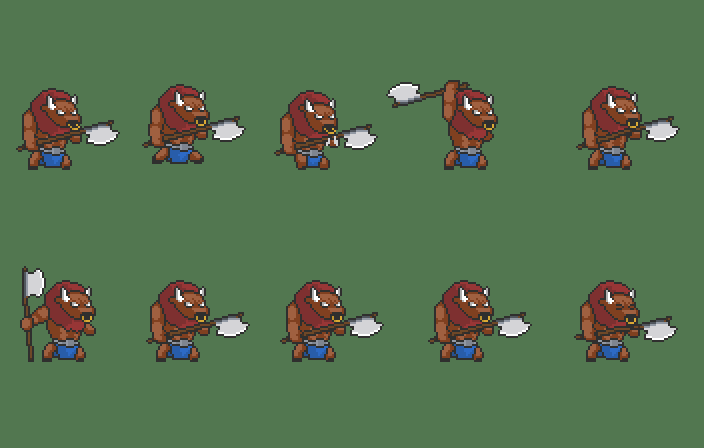
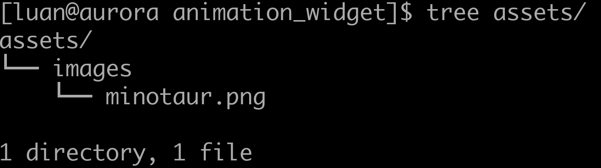
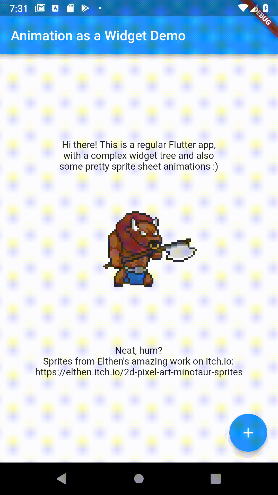

# Sprite Sheet Animations in Flutter

### UPDATE 05/27/2020

As for Flame 0.22.0 there is a new way to use Animations and Sprites inside your widget tree.

Flame now includes a widget catalog and inside it you will find `AnimationWidget` and `SpriteWidget`.

Check the example mentioned on this article to see the updated version.

## Introduction

Flutter provides lots of cool and slick animations out of the box, most related to movement and tweens (continuous changes in size, position, color, et cetera). However, one particular thing that it's really hard to do using only the native APIs is a simple sprite sheet animation. Or any sprite sheet handling, for that matter.

A sprite sheet is a single image that has multiple images (sprites) inside, each one being accessed via it's defining rectangle (x, y, width, and height). Maybe every sprite inside has the same size, like a tileset; for example:

<p align="center"> 
    
    <br />
    <small>This is the Dunjo Tileset, it was created by <a href="https://arks.itch.io/dungeon-platform-tileset">arks</a>.</small>
</p>

Let's say you want to have several icons in your app. Instead of loading to memory dozens of small images, you can load a single one and use sprites to refer to each icon. That's how fonts work under the hood (though normally those are SVG nowadays).

This practice is very common in web development, because of the infamous request overhead. Making a single request is (used to be? HTTP2 tries to solve this) way faster than several requests each with headers, wrappers, TCP/IP protocol packages and shenanigans you don't really see happening. But it's also very common in game development, and might be useful for your packaged mobile assets, because of how graphics cards work. Without digging too much into the topic, basically loading a single image is faster because the GPU doesn't need to keep switching the loaded images. Maybe some modern GPUs might even optimize this for multiple images, but having control over what gets bundled with what might be crucial if want to hit that sweet sweet 60 FPS mark.

Finally, especially when talking about animations, images of the sort are all distributed in sprite sheet format, and it's easier to add to your folder structure, understand and maintain, than having hundreds of files mixed up and needing to keep adding entries to your pubspec.yaml.

But I digress, this is an article about how to make sprite sheet animations, so if the title wasn't enough to encourage you to do so, nor this brief explanation of the concept, let's see if some graphics are.

There are a lot of websites out there that provide a plethora of assets, some cheap, some free, some even free for commercial usage, assets being sprite sheets for animations, tilesets, icon sets and much more. One that I highly recommend is [itch.io](https://itch.io). It's an awesome community of people who really love indie gaming, and I do recommend to check it out rather than Steam next time you want a more innovative title to play. But not only complete and WIP games are cataloged, but also resources and assets. There is a large collection of commercially free sprite sheets, like the Dunjo Tileset of the image before.

For our example, let's say you want to animate a mighty minotaur in your regular Flutter app. We go to itch.io and find this awesome asset pack, that comes, as expected, in sprite sheet format.

<p align="center"> 
    
    <br />
    <small>GIF showcasing the awesome minotaur animations created by <a href="https://elthen.itch.io/2d-pixel-art-minotaur-sprites">elthen</a>.</small>
</p>

I'm actually gonna crop and paste using imagemagick just the frames we are going to actually use, but that's just for simplicity and reducing the app size; remember, with sprite sheets, you decide what you use. Of course, you don't need to have stuff you never use in your sheets. Here is the final result:

<p align="center"> 
    
    <br />
    <small>Sprite sheet extract by me from the original files, available in the examples for the Flame repository. All credits to <a href="https://elthen.itch.io/">elthen</a>.</small>
</p>

Now, how are we going to render this as an animation, updating the frames clockwork, to have a fluid, functional, sprite sheet animation? Enters [flame](https://github.com/luanpotter/flame), the modular game engine. Yes, it's a game engine, but it's very small and modular, so you can easily pick and choose. I'm assuming your app isn't an actual game, though if it's a more interactive style experience, with game loops, updates, and renderers, you should consider using 100% flame instead (or alongside) of Flutter widgets. For a tutorial on game development on Flame, I do recommend the more up-to-date article posted by the awesome folks at [GeekyAnts](https://blog.geekyants.com/@geekyants): [Building A 2D game in Flutter](https://blog.geekyants.com/building-a-2d-game-in-flutter-a-comprehensive-guide-913f647846bc).

If you don't have a Flame game, don't worry. Flame allows you to embed complete and complex games right inside your widget tree from regular Flutter apps. And now there are some brand new helpers to allow you to easily do the most simple and request things flame provides: drawing sprite sheet animations. How come? Well, let's get right into it.

## Importing the sprite sheet

First things off, get a hold of your sprite sheet. That can be most images format, but since this is pixel art, a PNG is a must. We have our minotaur sample, you can choose other of your liking. Wanna add a ticking clock with fancy effects or a bomb that goes off? You can find all those beautiful assets online. The simplest way is to have a row of sprites of the same size, in the animation order, though it's fully configurable. Firstly, the folder structure. Flutter expects you to have an `assets` folder on your project root, and Flame expects an `images` folder, because you might have audio, fonts and other sorts of assets. Inside, put your image files.

<p align="center"> 
    
    <br />
    <small>This is the folder structure to create. `animation_widget` is the root folder (created by `flutter create`), inside an assets/images folder, and inside, all your assets.</small>
</p>

Also, don't forget to add everything to the `pubspec.yml`, where every asset must be declared; it should look something like this:

```yaml
flutter:
  assets:
    - assets/images/minotaur.png # thanks to https://elthen.itch.io/2d-pixel-art-minotaur-sprites
```

## Adding Flame

Flame's latest release is `0.10.1`, but this feature is available since `0.10.0`. Add the latest dependency to your `dependencies` in pubspec file and don't forget to run a `flutter pub get` to download everything:

```yaml
dependencies:
  flutter:
    sdk: flutter
  flame: 0.10.1

dev_dependencies:
  flutter_test:
    sdk: flutter
```

## Adding the animation to the tree

Let's you have your `build` method in one of your pages; pretty normal Flutter stuff. This a column filled with texts, that I copied from the example in the flame repository:

```dart
  @override
  Widget build(BuildContext context) {
    final key = GlobalKey<ScaffoldState>();
    return Scaffold(
      key: key,
      appBar: AppBar(
        title: Text('Animation as a Widget Demo'),
      ),
      body: Center(
        child: Column(
          mainAxisAlignment: MainAxisAlignment.center,
          children: <Widget>[
            Text('Hi there! This is a regular Flutter app,'),
            Text('with a complex widget tree and also'),
            Text('some pretty sprite sheet animations :)'),
            // magic!
            Text('Neat, hum?'),
            Text('Sprites from Elthen\'s amazing work on itch.io:'),
            Text('https://elthen.itch.io/2d-pixel-art-minotaur-sprites'),
          ],
        ),
      ),
      floatingActionButton: FloatingActionButton(
        onPressed: () => _clickFab(key),
        child: Icon(Icons.add),
      ),
    );
  }
```

Note that it could be any component, however complex, inside your widgets tree. Note also that I have omitted the "magic" of the equation here. How is it that we create a component for an animation? Very basically (more details in the flame tutorial), Flame provides components, one of which is the `AnimationComponent` that receives an `Animation` object describing the animation and does exactly what we want. All components live inside a `Game` instance, that can add custom logic relating to the game loop. For our case, we just want to create a simple, empty game and add a single `AnimationComponent` with a simple `Animation` inside. So Flame provides a helper to do that, the `Flame.util.animationAsWidget` method. It takes the size of the object as a Flame's `Position` instance (a generic class to represent a pair of doubles), and also takes in an `Animation` instance representing our frame list. To use that, let's import both `Flame` and the `Animation` class. However, since Flutter adds it's own animation classes, let's use an alias in order to not mess up the names. Therefore, add these imports to the top of the file:

```dart
import 'package:flame/animation.dart' as animation; // imports the Animation class under animation.Animation
import 'package:flame/flame.dart'; // imports the Flame helper class
import 'package:flame/position.dart'; // imports the Position class
```

How we do the magic then? Just add the following to your widget tree:

```dart
    Flame.util.animationAsWidget(Position(WIDTH, HEIGHT), animation.Animation.sequenced('minotaur.png', AMOUNT, textureWidth: FRAME_WIDTH))
```

The first parameter's `WIDTH` and `HEIGHT` are the actual size of the widget on the screen. This does not need to match the sprite size, as Flame will scale it for you. You might, however, wanna keep the aspect, so things don't get distorted. In your case, the minotaur asset is a row of 96x96 pixels, so squares, therefore we can scale keeping `WIDTH/HEIGHT = 1`. We will choose the size as 256 px. The `sequenced` constructor is a helper that easily creates the animation assuming equal-sized frames in a row, in order. You can configure the start x, start y, texture width and height, but those will default gracefully to (0,0) and the actual width and height of the file. You can create your animation passing in the frame list, each frame with a different step time and sprite (source rectangle).

In our case, we only need to set the `textureWidth` to 96.0, as the original width for the image is actually 19 x 96. Don't mix up texture coordinates, or source coordinates, that's the x, y inside the sprite sheet image and the size relating to that file, and the actual place and size the image/animation is going to be drawn on screen! Those are two very distinct things. We don't need to set the actual position as the widget tree will dictate that for us, we just provide the size as it's going to be a fixed size widget.

## Results

Now, just run your app, and, hurray!, we get a slick animation!

<p align="center">
    
    <br />
    <small>The final result, as recorded in the emulator!</small>
</p>

Pretty sweet, huh? And that's just the beginning. Explore Flame to add more complex, dynamic, even interactive animations, with different timings, behaviors and effects. You can start and stop your animations based on commands. You can do much, much more. Populate your apps with prettiness :)

Already thinking about the neat graphics you'll add to your apps? Be sure to check flame as an actual game engine, there is much more complex and cool stuff, that can work both as a standalone game or inside a Flutter widget tree (all features are like that). Also, Flame is built in a modular way, so you pick and choose, and also, I strongly encourage you to go through the implementation and see how things are done. If you want to change any details, you might get a lot of insight from the source code.

This whole example is inside the examples folder for flame, and you can see [the source code](https://github.com/luanpotter/flame/tree/master/doc/examples/animation_widget), if you have any doubts or wanna test or run yourself. Also, the article is [committed as well](https://github.com/luanpotter/flame/tree/master/doc/animation_widget_article).

If you liked Flame, leave your clap, star on GitHub, and please check out our [repository](https://github.com/luanpotter/flame) with full docs, examples, and issues you can ask. Also, for more in-depth questions, be sure to check our [Discord channel](https://discord.gg/pxrBmy4), where we try to answer questions and solve problems.
