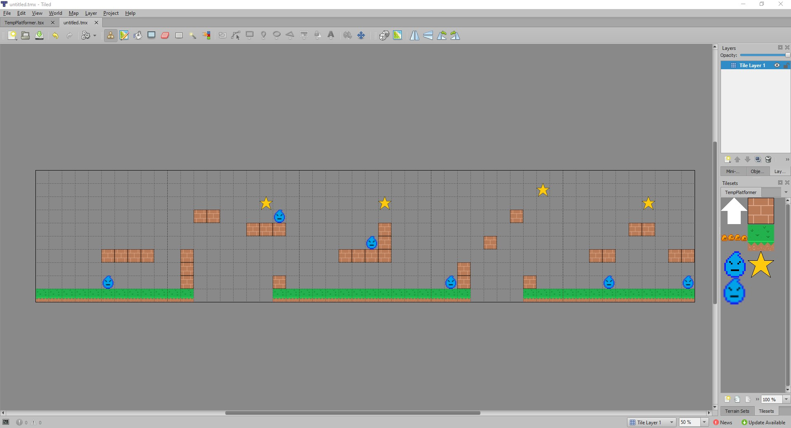

# Tiled

[Tiled] is a great tool to design levels and maps.  From [Tiled]'s documentation:

> Tiled is a 2D level editor that helps you develop the content of your game. Its
> primary feature is to edit tile maps of various forms, but it also supports
> free image placement as well as powerful ways to annotate your level with extra
> information used by the game. Tiled focuses on general flexibility while trying
> to stay intuitive.
>
> In terms of tile maps, it supports straight rectangular tile layers, but also
> projected isometric, staggered isometric and staggered hexagonal layers. A
> tileset can be either a single image containing many tiles, or it can be a
> collection of individual images. In order to support certain depth faking
> techniques, tiles and layers can be offset by a custom distance and their
> rendering order can be configured.

Flame provides a package ([flame_tiled]) that bundles a [dart] package which allows you to parse TMX
(XML) files and access the tiles, objects, and everything in there.

The [dart] package provides a simple `Tiled` class and [flame_tiled] provides a component wrapper
`TiledComponent`, for the map rendering, which renders the tiles on the screen and supports
rotations and flips.

## Tiled Editor

You can choose to download the [Tiled] map editor and create interactive maps that can be loaded
into your game.  At its core, the [Tiled] map editor creates a TMX file that can be parsed and used
within your game.

[dart]: https://pub.dev/packages/tiled
[flame_tiled]: https://github.com/flame-engine/flame_tiled
[Tiled]: https://www.mapeditor.org/
