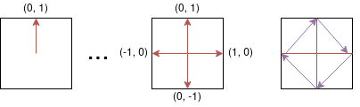

# Collision detection
If you want to have a full blown physics engine in your game we recommend that you use
Forge2D by adding [flame_forge2d](https://github.com/flame-engine/flame_forge2d) as a dependency.
But if you have a simpler use-case and just want to check for collisions of components and improve
the accuracy of gestures, Flame's built-in collision detection will serve you very well.

If you have the following needs you should at least consider to use
[Forge2D](https://github.com/flame-engine/forge2d):
 - Interacting realistic forces
 - Particle systems that can interact with other bodies
 - Joints between bodies
 - Many bodies at the same time (~50+ depends a bit on platform)

It is a good idea to just use the Flame collision detection system if you on the other hand only
need some of the following things (since it is slightly simpler to not involve Forge2D):
 - The ability to act on when some of your components collide
 - The ability to act on when your components collide with the screen boundaries
 - Complex shapes to act as a hitbox for your component so that gestures will be more accurate
 - Hitboxes that can tell what part of a component that collided with something

The collision detection system supports three different types of shapes that you can build hitboxes
from, these shapes are Polygon, Rectangle and Circle. A hitbox can be represented by many shapes to
form the area which can be used to either detect collisions or whether it contains a point or not,
the latter is very useful for accurate gesture detection. The collision detection does not handle
what should happen when two hitboxes collide, so it is up to the user to implement what will happen
when for example two position components have intersecting hitboxes.

Do note that the built-in collision detection system does not take collisions between two hitboxes
that overshoot each other into account, this could happen when they either move too fast or `update`
being called with a large delta time (for example if your app is not in the foreground). This
behaviour is called tunneling, if you want to read more about it.

## Mixins
### Hitbox
The `Hitbox` mixin is mainly used for two things; to make detection of collisions with other
hitboxes and to more accurately recognize gestures on top of your `PositionComponent`s. Say that you
have a fairly round rock as a `SpriteComponent` for example, then you don't want to register input
that is in the corner of the image where the rock is not displayed, since an image is always
rectangular. Then you can use the `Hitbox` mixin to define a more accurate polygon (or another
shape) for which the input should be within for the event to be registered on your component.

You can add new shapes to the `Hitbox` just like they are added in the below `Collidable` example.

### Collidable
The `Collidable` mixin is added to a `PositionComponent` that has a `HitBox` and it is used for
detecting collisions with other `Collidable`s. If you do not add a shape to your `Hitbox` component
it will never collide with anything. If you want the component to have a default rectangular shape
that fills the size of your component you can simply do `addHitbox(HitboxRectangle())`.

To make your component collidable you would start off something like this:

```dart
class MyCollidable extends PositionComponent with Hitbox, Collidable {
  MyCollidable (
    // This could also be done in onLoad instead of in the constructor
    final shape = HitboxPolygon([
      Vector2(0, 1),
      Vector2(1, 0),
      Vector2(0, -1),
      Vector2(-1, 0),
    ]);
    addHitbox(shape);
  }
}
```

The `HitboxPolygon` added to the `Collidable` here is a diamond shape(◇).
More about how the different shapes are defined in the [Shapes](#Shapes) section.

Remember that you can add as many `HitboxShape`s as you want to your `Collidable` to make up more
complex hitboxes. For example a snowman with a hat could be represented by three `HitboxCircle`s and
a `HitboxPolygon` as its hat.

To react to a collision you should override the `collisionCallback` in your component.
Example:

```dart
class MyCollidable extends PositionComponent with Hitbox, Collidable {
  ...

  @override
  void onCollision(Set<Vector2> points, Collidable other) {
    if (other is CollidableScreen) {
      ...
    } else if (other is YourOtherCollidable) {
      ...
    }
  }

  @override
  void onCollisionEnd(Collidable other) {
    if (other is CollidableScreen) {
      ...
    } else if (other is YourOtherCollidable) {
      ...
    }
  }
}
```

In this example it can be seen how the Dart `is` keyword is used to check which other `Collidable`
that your component collided with. The set of points is where the edges of the hitboxes collided.
Note that the `onCollision` method will be called on both collidable components if they
have both implemented the `onCollision` method, and also on both shapes if they have that method
implemented. The same goes for the `onCollisionEnd` method, which is called when two components or
shapes that were previously colliding no longer colliding with each other.

If you want to check collisions with the screen edges, as we do in the example above, you can use
the predefined [ScreenCollidable](#ScreenCollidable) class and since that one also is a `Collidable`
you can implement your own `onCollision` method for that class if needed.

#### CollidableType
By default the `CollidableType` is `active` on your `Collidable`, but there are two other types that
you can set your collidable to too if you need to optimize the collision detection.

The `CollidableType` enum contains the following values:

 - `active` collides with other `Collidable`s of type active or passive
 - `passive` collides with other `Collidable`s of type active
 - `inactive` will not collide with any other `Collidable`s

So if you have collidables that you don't need to check collisions against each other you can mark
them as passive by setting `collidableType = CollidableType.passive`, this could for example be
ground components or maybe your enemies don't need to check collisions between each other, then they
could be marked as passive too.

Then we have the `inactive` type which simply doesn't get checked at all in the collision detection.
This could be used for example if you have components outside of the screen that you don't care
about at the moment but that might later come back in to view so they are not completely removed
from the game.

These are just examples of how you could use these types, there will be a lot more use cases for
them so don't doubt to use them even if your use case isn't listed here.

### HasCollidables
If you want to use this collision detection in your game you have to add the `HasCollidables` mixin
to your game so that the game knows that it should keep track of which components that can collide.

Example:
```dart
class MyGame extends FlameGame with HasCollidables {
  ...
}
```

Now when you add your `Collidable` components to your game they will automatically be checked for
collisions.

### ScreenCollidable
`ScreenCollidable` is not a mixin, but a pre-made collidable component which represents the edges of
your game/screen. If you add a `ScreenCollidable` to your game your other collidables will be
notified when they collide with the edges. It doesn't take any arguments, it only depends on the
`size` of the game that it is added to. To add it you can just do `add(ScreenCollidable())` in
your game, if you don't want the `ScreenCollidable` itself to be notified when something collides
with it. If you so want it to be notified, then you need to extend it and implement the
`collisionCallback` method for it.

## Shapes
### Shape
A Shape is the base class for representing a scalable geometrical shape. The shapes have different
ways of defining how they look, but they all have a size and angle that can be modified and the
shape definition will scale or rotate the shape accordingly.

There are currently three shapes: [Polygon](#Polygon), [Rectangle](#Rectangle) and
[Cirlce](#Circle).

### HitboxShape
A `HitboxShape` is a `Shape` defined from the center position of the component that it is attached
to and it has the same bounding size and angle as the component. You can set `localPosition` to have
the position of the shape deviate from the center of the component. A `HitboxShape` is the type of
shape that you add to your `Hitbox`, or `Collidable`. Usually these types of shapes are the only
ones that you need to use.

#### HitboxPolygon
It should be noted that if you want to use collision detection or `containsPoint` on the `Polygon`,
the polygon needs to be convex. So always use convex polygons or you will most likely run into
problems if you don't really know what you are doing. It should also be noted that you should always
define the vertices in your polygon in a clockwise order.

In comparision to the normal `Polygon`, there is only one way to create a `HitboxPolygon`, the only
mandatory argument is a list of `Vector2` which defines how your polygon should look, but not the
size or position for it (since that sill be defined by the component that you attach it to).
For example you could create a diamond like in the [Collidable](#Collidable) example like this:

```dart
HitboxPolygon([
  Vector2(0, 1),  // Middle of top wall
  Vector2(1, 0),  // Middle of right wall
  Vector2(0, -1), // Middle of bottom wall
  Vector2(-1, 0), // Middle of left wall
]);
```

The other hitbox shapes don't have any mandatory constructor, but that is because they can have a
sane default calculated from the size of the collidable that they are attached to, but since a
polygon can be made in an infinite number of ways inside of a bounding box you have to add the
definition in the constructor for this shape.

The vectors in the example defines percentages of the length from the center to the edge of the
screen in both x and y axis, so for our first item in our list (`Vector2(0, 1)`) we are pointing on
on the middle of the top wall of the bounding box, since the cordinate system here is defined from
the center of the polygon.



In the image you can see how the polygon shape formed by the purple arrows is defined by the red
arrows.


#### HitboxRectangle
A `HitboxRectangle` is really just a simplified Polygon, but it can be defined more easily.
To create rectangle you add a `relation` in the constructor which defines the relationship between
the length of the horizontal and vertical side and the size of the bounding box. To create a
`HitboxRectangle` that has half of the width and the full height of the bounding box (`size`)) you
do this: `HitboxRectangle(definition: Vector2(0.5, 1.0));`.

Once you have added the `HitboxRectangle` to a collidable component it will be sized and positioned
in relation to that component. So if the size of your component is `Vector2(400, 200)` and the
relation argument is the same as above your rectangle would be placed in the middle of the component
and be 200 pixels wide and 200 pixels tall.

#### HitboxCircle
When creating a `Circle` you can define how long the radius is in comparison to the shortest edge
of the bounding box, this is the `definition` argument.

So if you want to create a circle that is positioned as for example a head for your component that
has the size `Vector2(100, 400)` and you want the head to be half of the width and have its center
on the top fourth of the component you would write something like this:

`HitboxCircle(definition: 0.5)..relativePosition = Vector2(0, 0.5)`

### Normal Shapes
These shapes are meant as a tool for using geometrical shapes in a more general way than together
with the collision detection system.

#### Polygon
You can also create you `Polygon` by giving it a list of points in the constructor.
This list will be transformed into a polygon with a size, which can still be scaled and rotated.

#### Rectangle
Dart already has an excellent way to create rectangles and that class is called `Rect`, you can
create a Flame `Rectangle` from a `Rect` by using the `Rectangle.fromRect` factory, and just like
with the `Polygon` factory, your rectangle will be sized according to the `Rect` if you use this
factory.

You can also use the default constructor to build your rectangle from a position, size and angle.

#### Circle
If you know how long your circle's position and/or how long the radius is going to be from the start
you can use the optional arguments `radius` and `position` to set those, if the `radius` is set the
`size` of the `Circle` will be automatically set too.

## Example
https://github.com/flame-engine/flame/tree/main/examples/lib/stories/collidables