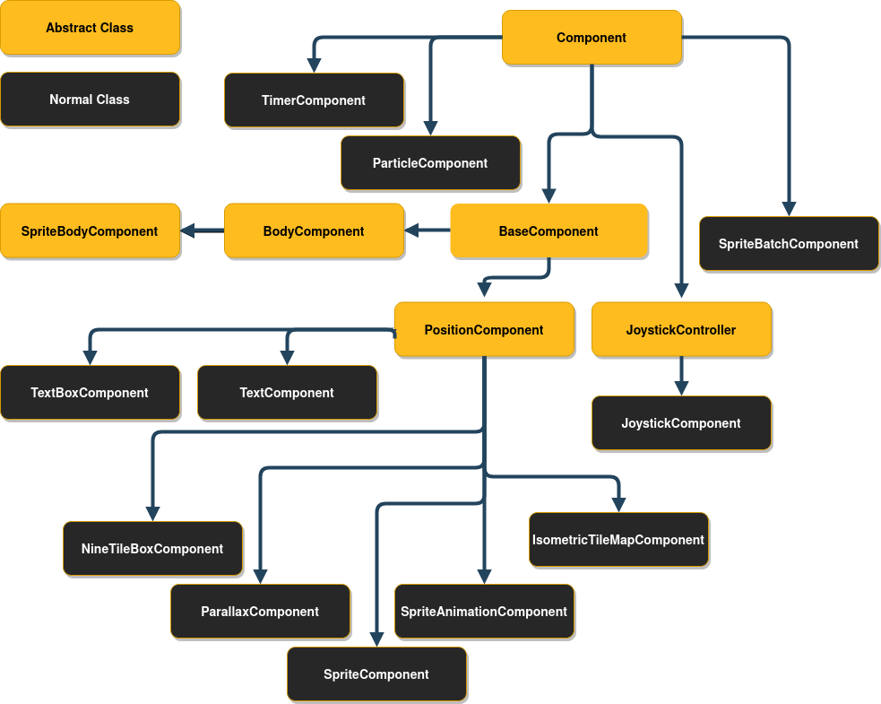
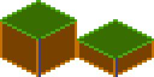
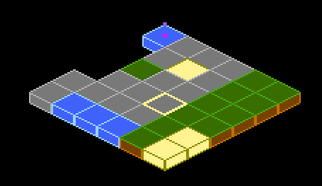

# Components



This diagram might look intimidating, but don't worry, it is not as complex as it looks.

## Component
All components inherit from the abstract class `Component`.

If you want to skip reading about abstract classes you can jump directly to
[PositionComponent](./components.md#PositionComponent).

Every `Component` has a few methods that you can optionally implement, which are used by the
`FlameGame` class. If you are not using `FlameGame`, you can use these methods on your own game loop
if you wish.


The `onGameResize` method is called whenever the screen is resized, and once in the beginning when
the component is added to the game via the `add` method.

The `shouldRemove` variable can be overridden or set to true and `FlameGame` will remove the
component before the next update loop. It will then no longer be rendered or updated. Note that
`game.remove(Component c)` and `component.removeFromParent()` also can be used to remove components
from its parent.

The `isHUD` variable can be overridden or set to true (defaults to `false`) to make the `FlameGame`
ignore the `camera` for this element, making it static in relation to the screen that is.
Do note that this currently only works if the component is added directly to the root `FlameGame`.

The `onRemove` method can be overridden to run code before the component is removed from the game,
it is only run once even if the component is removed both by using the parents remove method and
the `Component` remove method.

The `onLoad` method can be overridden to run asynchronous initialization code for the component,
like loading an image for example. This method is executed after the initial "preparation" of the
component has finished the first time, meaning that this method is executed after the first
`onGameResize` call and just before the inclusion of the component in the `FlameGame`'s (or another
`Component`'s) list of components.

The `onMount` method can be overridden to run asynchronous initialization code that should
run every time the component is added to a new parent. This means that you should not initialize
`late` variables here, since this method might run several times throughout the component's
lifetime. This method is executed after the initial "preparation" of the component is done and after
`onGameResize` and `onLoad`, but before the inclusion of the component in the parent's list of
components.

## BaseComponent
Usually if you are going to make your own component you want to extend `PositionComponent`, but if
you want to be able to handle effects and child components but handle the positioning differently
you can extend the `Component` directly.

`Component` is used by `SpriteBodyComponent`, `PositionBodyComponent`, and `BodyComponent` in
`flame_forge2d` since those components doesn't have their position in relation to the screen, but in
relation to the Forge2D world.

### Composability of components

Sometimes it is useful to wrap other components inside of your component. For example by grouping
visual components through a hierarchy. You can do this by adding child components to any component,
for example `PositionComponent`.
When you have child components on a component every time the parent is updated and rendered, all the
children are rendered and updated with the same conditions.

Example of usage, where visibility of two components are handled by a wrapper:

```dart
class GameOverPanel extends PositionComponent with HasGameRef<MyGame> {
  bool visible = false;
  final Image spriteImage;

  GameOverPanel(this.spriteImage);

  @override
  Future<void> onLoad() async {
    final gameOverText = GameOverText(spriteImage); // GameOverText is a Component
    final gameOverButton = GameOverButton(spriteImage); // GameOverRestart is a SpriteComponent

    add(gameOverText);
    add(gameOverButton);
  }

  @override
  void render(Canvas canvas) {
    if (visible) {
      super.render(canvas);
    } // If not visible none of the children will be rendered
  }
}
```

## PositionComponent

This class represent a single object on the screen, being a floating rectangle or a rotating sprite.

A `PositionComponent` has a `position`, `size` and `angle`, as well as some useful methods like
`distance` and `angleBetween`.

When implementing the `render` method for a component that extends `PositionComponent` remember to
render from the top left corner (0.0). Your render method should not handle where on the screen your
component should be rendered. To handle where and how your component should be rendered use the
`position`, `angle` and `anchor` properties and flame will automatically handle the rest for you.

If you really want to handle the canvas translations yourself you can just omit the
`super.render(canvas)` line and suppress the warning, but for most use cases this is not
recommended.

If you want to know where on the screen the bounding box of the component is you can use the
`toRect` method.

In the event that you want to change the direction of your components rendering, you can also use
`renderFlipX` and `renderFlipY` to flip anything drawn to canvas during `render(Canvas canvas)`.
This is available on all `PositionComponent` objects, and is especially useful on `SpriteComponent`
and `SpriteAnimationComponent`. For example set `component.renderFlipX = true` to mirror the
horizontal rendering.

## SpriteComponent
The most commonly used implementation of `PositionComponent` is `SpriteComponent`, and it can be
created with a `Sprite`:

```dart
import 'package:flame/components/component.dart';

class MyGame extends FlameGame {
  late final SpriteComponent player;

  @override
  Future<void> onLoad() async {
    final sprite = await Sprite.load('player.png');
    final size = Vector2.all(128.0);
    final player = SpriteComponent(size: size, sprite: sprite);

    // screen coordinates
    player.position = ... // Vector2(0.0, 0.0) by default, can also be set in the constructor
    player.angle = ... // 0 by default, can also be set in the constructor
    add(player); // Adds the component
  }
}
```

## SpriteAnimationComponent

This class is used to represent a Component that has sprites that run in a single cyclic animation.

This will create a simple three frame animation using 3 different images:

```dart
final sprites = [0, 1, 2]
    .map((i) => Sprite.load('player_$i.png'));
final animation = SpriteAnimation.spriteList(
  await Future.wait(sprites),
  stepTime: 0.01,
);
this.player = SpriteAnimationComponent(
  animation: animation,
  size: Vector2.all(64.0),
);
```

If you have a sprite sheet, you can use the `sequenced` constructor from the `SpriteAnimationData`
class (check more details on [Images &gt; Animation](images.md#Animation)):

```dart
final size = Vector2.all(64.0);
final data = SpriteAnimationData.sequenced(
  textureSize: size,
  amount: 2,
  stepTime: 0.1,
);
this.player = SpriteAnimationComponent.fromFrameData(
  await images.load('player.png'),
  data,
);
```

If you are not using `FlameGame`, don't forget this component needs to be updated, because the
animation object needs to be ticked to move the frames.

## SpriteAnimationGroup

`SpriteAnimationGroupComponent` is a simple wrapper around `SpriteAnimationComponent` which enables
your component to hold several animations and change the current playing animation in runtime.

Its use is very similar to the `SpriteAnimationComponent` but instead of being initialized with a
single animation, this component receives a Map of a generic type `T` as key and a
`SpriteAnimation` as value, and the current animation.

Example:

```dart
enum RobotState {
  idle,
  running,
}

final running = await loadSpriteAnimation(/* omited */);
final idle = await loadSpriteAnimation(/* omited */);

final robot = SpriteAnimationGroupComponent<RobotState>(
  animations: {
    RobotState.running: running,
    RobotState.idle: idle,
  },
  current: RobotState.idle,
);

// Changes current animation to "running"
robot.current = RobotState.running;
```

## SpriteGroup

`SpriteGroupComponent` is pretty similar to its animation counterpart, but especially for sprites.

Example:

```dart
class ButtonComponent extends SpriteGroupComponent<ButtonState>
    with HasGameRef<SpriteGroupExample>, Tappable {
  @override
  Future<void>? onLoad() async {
    final pressedSprite = await gameRef.loadSprite(/* omited */);
    final unpressedSprite = await gameRef.loadSprite(/* omited /*);

    sprites = {
      ButtonState.pressed: pressedSprite,
      ButtonState.unpressed: unpressedSprite,
    };

    current = ButtonState.unpressed;
  }

  // tap methods handler omited...
}

```

## SvgComponent

**Note**: To use SVG with Flame, use the [`flame_svg`](https://github.com/flame-engine/flame_svg)
package.

This component uses an instance of `Svg` class to represent a Component that has a svg that is
rendered in the game:

```dart
final svg = await Svg.load('android.svg');
final android = SvgComponent.fromSvg(
  svg,
  position: Vector2.all(100),
  size: Vector2.all(100),
);
```

## FlareActorComponent

**Note**: The previous implementation of a Flare integration API using `FlareAnimation` and
`FlareComponent` has been deprecated.

To use Flare within Flame, use the [`flame_flare`](https://github.com/flame-engine/flame_flare)
package.

This is the interface for using a [flare animation](https://pub.dev/packages/flare_flutter) within
flame. `FlareActorComponent` has almost the same API as of flare's `FlareActor` widget. It receives
the animation filename (that is loaded by default with `Flame.bundle`), it can also receive a
FlareController that can play multiple animations and control nodes.

```dart
import 'package:flame_flare/flame_flare.dart';

class YourFlareController extends FlareControls {

  late ActorNode rightHandNode;

  void initialize(FlutterActorArtboard artboard) {
    super.initialize(artboard);

    // get flare node
    rightHand = artboard.getNode('right_hand');
  }
}

final fileName = 'assets/george_washington.flr';
final size = Vector2(1776, 1804);
final controller = YourFlareController();

FlareActorComponent flareAnimation = FlareActorComponent(
  fileName,
  controller: controller,
  width: 306,
  height: 228,
);

flareAnimation.x = 50;
flareAnimation.y = 240;
add(flareAnimation);

// to play an animation
controller.play('rise_up');

// you can add another animation to play at the same time
controller.play('close_door_way_out');

// also, you can get a flare node and modify it
controller.rightHandNode.rotation = math.pi;
```

You can also change the current playing animation by using the `updateAnimation` method.

For a working example, check the example in the
[flame_flare repository](https://github.com/flame-engine/flame_flare/tree/main/example).

## ParallaxComponent

This `Component` can be used to render backgrounds with a depth feeling by drawing several transparent
images on top of each other, where each image or animation (`ParallaxRenderer`) is moving with a
different velocity.

The rationale is that when you look at the horizon and moving, closer objects seem to move faster
than distant ones.

This component simulates this effect, making a more realistic background effect.

The simplest `ParallaxComponent` is created like this:

```dart
@override
Future<void> onLoad() async {
  final parallaxComponent = await loadParallaxComponent([
    ParallaxImageData('bg.png'),
    ParallaxImageData('trees.png'),
  ]);
  add(parallax);
}
```

A ParallaxComponent can also "load itself" by implementing the `onLoad` method:

```dart
class MyParallaxComponent extends ParallaxComponent with HasGameRef<MyGame> {
  @override
  Future<void> onLoad() async {
    parallax = await gameRef.loadParallax([
      ParallaxImageData('bg.png'),
      ParallaxImageData('trees.png'),
    ]);
  }
}

class MyGame extends FlameGame {
  @override
  Future<void> onLoad() async {
    add(MyParallaxComponent());
  }
}
```

This creates a static background, if you want a moving parallax (which is the whole point of a
parallax), you can do it in a few different ways depending on how fine grained you want to set the
settings for each layer.
They simplest way is to set the named optional parameters `baseVelocity` and
`velocityMultiplierDelta` in the `load` helper function.

For example if you want to move your background images along the X-axis with a faster speed the
"closer" the image is:

```dart
final parallaxComponent = await loadParallaxComponent(
  _dataList,
  baseVelocity: Vector2(20, 0),
  velocityMultiplierDelta: Vector2(1.8, 1.0),
);
```

You can set the baseSpeed and layerDelta at any time, for example if your character jumps or your
game speeds up.

```dart
final parallax = parallaxComponent.parallax;
parallax.baseSpeed = Vector2(100, 0);
parallax.velocityMultiplierDelta = Vector2(2.0, 1.0);
```

By default the images are aligned to the bottom left, repeated along the X-axis and scaled
proportionally so that the image covers the height of the screen. If you want to change this
behavior, for example if you are not making a side scrolling game, you can set the `repeat`,
`alignment` and `fill` parameters for each `ParallaxRenderer` and add them to `ParallaxLayer`s that you
then pass in to the `ParallaxComponent`'s constructor.

Advanced example:
```dart
final images = [
  loadParallaxImage('stars.jpg', repeat: ImageRepeat.repeat, alignment: Alignment.center, fill: LayerFill.width),
  loadParallaxImage('planets.jpg', repeat: ImageRepeat.repeatY, alignment: Alignment.bottomLeft, fill: LayerFill.none),
  loadParallaxImage('dust.jpg', repeat: ImageRepeat.repeatX, alignment: Alignment.topRight, fill: LayerFill.height),
];
final layers = images.map((image) => ParallaxLayer(await image, velocityMultiplier: images.indexOf(image) * 2.0));
final parallaxComponent = ParallaxComponent.fromParallax(
  Parallax(
    await Future.wait(layers),
    baseVelocity: Vector2(50, 0),
  ),
);
```

 - The stars image in this example will be repeatedly drawn in both axis, align in the center and be
 scaled to fill the screen width.
 - The planets image will be repeated in Y-axis, aligned to the bottom left of the screen and not be
 scaled.
 - The dust image will be repeated in X-axis, aligned to the top right and scaled to fill the screen
 height.

Once you are done setting up your `ParallaxComponent`, add it to the game like with any other
component (`game.add(parallaxComponent`).
Also, don't forget to add you images to the `pubspec.yaml` file as assets or they wont be found.

The `Parallax` file contains an extension of the game which adds `loadParallax`, `loadParallaxLayer`
, `loadParallaxImage` and `loadParallaxAnimation` so that it automatically uses your game's image cache instead of the global
one. The same goes for the `ParallaxComponent` file, but that provides `loadParallaxComponent`.

If you want a fullscreen `ParallaxComponent` simply omit the `size` argument and it will take the
size of the game, it will also resize to fullscreen when the game changes size or orientation.

Flame provides two kinds of `ParallaxRenderer`: `ParallaxImage` and `ParallaxAnimation`, `ParallaxImage` is a static image renderer and `ParallaxAnimation` is, as it's name implies, an animation and frame based renderer.
It is also possible to create custom renderers by extending the `ParallaxRenderer` class.

Three example implementations can be found in the
[examples directory](https://github.com/flame-engine/flame/tree/main/examples/lib/stories/parallax).

## SpriteBodyComponent

See [SpriteBodyComponent](forge2d.md#SpriteBodyComponent) in the Forge2D documentation.

## TiledComponent

Currently we have a very basic implementation of a Tiled component. This API uses the lib
[tiled.dart](https://github.com/flame-engine/tiled.dart) to parse map files and render visible
layers.

An example of how to use the API can be found
[here](https://github.com/flame-engine/flame_tiled/tree/main/example).

## IsometricTileMapComponent

This component allows you to render an isometric map based on a cartesian matrix of blocks and an
isometric tileset.

A simple example on how to use it:

```dart
// Creates a tileset, the block ids are automatically assigned sequentially starting at 0,
// from left to right and then top to bottom.
final tilesetImage = await images.load('tileset.png');
final tileset = IsometricTileset(tilesetImage, 32);
// Each element is a block id, -1 means nothing
final matrix = [[0, 1, 0], [1, 0, 0], [1, 1, 1]];
add(IsometricTileMapComponent(tileset, matrix));
```

It also provides methods for converting coordinates so you can handle clicks, hovers, render
entities on top of tiles, add a selector, etc.

You can also specify the `tileHeight`, which is the vertical distance between the bottom and top
planes of each cuboid in your tile. Basically, it's the height of the front-most edge of your
cuboid; normally it's half (default) or a quarter of the tile size. On the image below you can see
the height colored in the darker tone:



This is an example of how a quarter-length map looks like:



Flame's Example app contains a more in-depth example, featuring how to parse coordinates to make a
selector. The code can be found
[here](https://github.com/flame-engine/flame/blob/main/examples/lib/stories/tile_maps/isometric_tile_map.dart),
and a live version can be seen [here](https://examples.flame-engine.org/#/Tile%20Maps_Isometric%20Tile%20Map).
## NineTileBoxComponent

A Nine Tile Box is a rectangle drawn using a grid sprite.

The grid sprite is a 3x3 grid and with 9 blocks, representing the 4 corners, the 4 sides and the
middle.

The corners are drawn at the same size, the sides are stretched on the side direction and the middle
is expanded both ways.

Using this, you can get a box/rectangle that expands well to any sizes. This is useful for making
panels, dialogs, borders.

Check the example app
[nine_tile_box](https://github.com/flame-engine/flame/blob/main/examples/lib/stories/utils/nine_tile_box.dart)
for details on how to use it.

## Effects

Flame provides a set of effects that can be applied to a certain type of components, these effects
can be used to animate some properties of your components, like position or dimensions.
You can check the list of those effects [here](effects.md).

Examples of the running effects can be found [here](https://github.com/flame-engine/flame/blob/main/examples/lib/stories/effects);
