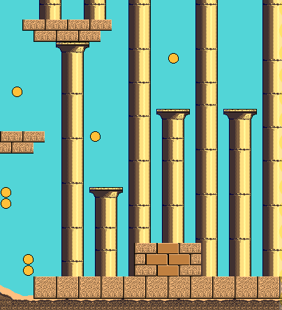
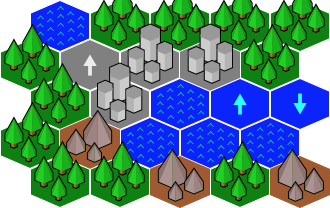
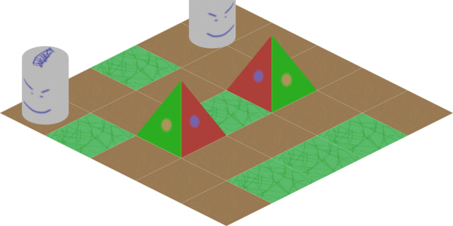

# Components

```{include} diagrams/component.md
```

This diagram might look intimidating, but don't worry, it is not as complex as it looks.


## Component

All components inherit from the abstract class `Component` and all components can have other
`Component`s as children. This is the base of what we call the Flame Component System, or FCS for
short.

Children can be added either with the `add(Component c)` method or directly in the constructor.

Example:

```dart
void main() {
  final component1 = Component(children: [Component(), Component()]);
  final component2 = Component();
  component2.add(Component());
  component2.addAll([Component(), Component()]);
}
```

The `Component()` here could of course be any subclass of `Component`.

Every `Component` has a few methods that you can optionally implement, which are used by the
`FlameGame` class.


### Component lifecycle

```{include} diagrams/component_life_cycle.md
```

The `onGameResize` method is called whenever the screen is resized, and once in the beginning when
the component is added to the game via the `add` method.

The `onRemove` method can be overridden to run code before the component is removed from the game,
it is only run once even if the component is removed both by using the parents remove method and
the `Component` remove method.

The `onLoad` method can be overridden to run asynchronous initialization code for the component,
like loading an image for example. This method is executed after `onGameResize`, but before
`onMount`. This method is guaranteed to execute only once during the lifetime of the component, so
you can think of it as an "asynchronous constructor".

The `onMount` method runs every time when the component is mounted into a game tree. This means that
you should not initialize `late final` variables here, since this method might run several times
throughout the component's lifetime. This method will only run if the parent is already mounted.
If the parent is not mounted yet, then this method will wait in a queue (this will have no effect
on the rest of the game engine).

The `onChildrenChanged` method can be overridden if it's needed to detect changes in a parent's
children. This method is called whenever a child is added to or removed from a parent (this includes
if a child is changing its parent). Its parameters contain the targeting child and the type of
change it went through (`added` or `removed`).

A component lifecycle state can be checked by a series of getters:

- `isLoaded`: Returns a bool with the current loaded state.
- `loaded`: Returns a future that will complete once the component has finished loading.
- `isMounted`: Returns a bool with the current mounted state.
- `mounted`: Returns a future that will complete once the component has finished mounting.
- `isRemoved`: Returns a bool with the current removed state.
- `removed`: Returns a future that will complete once the component has been removed.


### Priority

In Flame every `Component` has the `int priority` property, which determines
that component's sorting order within its parent's children. This is sometimes referred to
as `z-index` in other languages and frameworks. The higher the `priority` is set to, the
closer the component will appear on the screen, since it will be rendered on top of any components
with lower priority that were rendered before it.

If you add two components and set one of their priorities to 1 for example, then that component will
be rendered on top of the other component (if they overlap), because the default priority is 0.

All components take in `priority` as a named argument, so if you know the priority that you want
your component at compile time, then you can pass it in to the constructor.

Example:

```dart
class MyGame extends FlameGame {
  @override
  Future<void> onLoad() {
    final myComponent = PositionComponent(priority: 5);
    add(myComponent);
  }
}
```

To update the priority of a component you have to set it to a new value, like
`component.priority = 2`, and it will be updated in the next tick.

Example:

```dart
class MyComponent extends PositionComponent with Tappable {

  MyComponent() : super(priority: 1);

  @override
  void onTap() {
    priority = 2;
  }
}
```

In the example above we first initialize the component with priority 1, and then when the user taps
the component we change the priority to 2.


### Composability of components

Sometimes it is useful to wrap other components inside of your component. For example by grouping
visual components through a hierarchy. You can do this by adding child components to any component,
for example `PositionComponent`.

When you have child components on a component every time the parent is updated and rendered, all the
children are rendered and updated with the same conditions.

Example of usage, where visibility of two components are handled by a wrapper:

```dart
class GameOverPanel extends PositionComponent {
  bool visible = false;
  final Image spriteImage;

  GameOverPanel(this.spriteImage);

  @override
  Future<void> onLoad() async {
    final gameOverText = GameOverText(spriteImage); // GameOverText is a Component
    final gameOverButton = GameOverButton(spriteImage); // GameOverRestart is a SpriteComponent

    add(gameOverText);
    add(gameOverButton);
  }

  @override
  void render(Canvas canvas) {
    if (visible) {
    } // If not visible none of the children will be rendered
  }
}
```

There are two methods for adding children components to your component. First,
you have methods `add()`, `addAll()`, and `addToParent()`, which can be used
at any time during the game. Traditionally, children will be created and added
from the component's `onLoad()` method, but it is also common to add new
children during the course of the game.

The second method is to use the `children:` parameter in the component's
constructor. This approach more closely resembles the standard Flutter API:

```dart
class MyGame extends FlameGame {
  @override
  Future<void> onLoad() async {
    add(
      PositionComponent(
        position: Vector2(30, 0),
        children: [
          HighScoreDisplay(),
          HitPointsDisplay(),
          FpsComponent(),
        ],
      ),
    );
  }
}
```

The two approaches can be combined freely: the children specified within the
constructor will be added first, and then any additional child components
after.

Note that the children added via either methods are only guaranteed to be
available eventually: after they are loaded and mounted. We can only assure
that they will appear in the children list in the same order as they were
scheduled for addition.


### Ensuring a component has a given parent

When a component requires to be added to a specific parent type the
`ParentIsA` mixin can be used to enforce a strongly typed parent.

Example:

```dart
class MyComponent extends Component with ParentIsA<MyParentComponent> {
  @override
  Future<void> onLoad() async {
    // parent is of type MyParentComponent
    print(parent.myValue);
  }
}
```

If you try to add `MyComponent` to a parent that is not `MyParentComponent`,
an assertion error will be thrown.


### Ensuring a component has a given ancestor

When a component requires to have a specific ancestor type somewhere in the
component tree, `HasAncestor` mixin can be used to enforce that relationship.

The mixin exposes the `ancestor` field that will be of the given type.

Example:

```dart
class MyComponent extends Component with HasAncestor<MyAncestorComponent> {
  @override
  Future<void> onLoad() async {
    // ancestor is of type MyAncestorComponent.
    print(ancestor.myValue);
  }
}
```

If you try to add `MyComponent` to a tree that does not contain `MyAncestorComponent`,
an assertion error will be thrown.


### Querying child components

The children that have been added to a component live in a `QueryableOrderedSet` called
`children`. To query for a specific type of components in the set, the `query<T>()` function can be
used. By default `strictMode` is `false` in the children set, but if you set it to true, then the
queries will have to be registered with `children.register` before a query can be used.

If you know in compile time that you later will run a query of a specific type it is recommended to
register the query, no matter if the `strictMode` is set to `true` or `false`, since there are some
performance benefits to gain from it. The `register` call is usually done in `onLoad`.

Example:

```dart
@override
Future<void> onLoad() async {
  children.register<PositionComponent>();
}
```

In the example above a query is registered for `PositionComponent`s, and an example of how to query
the registered component type can be seen below.

```dart
@override
void update(double dt) {
  final allPositionComponents = children.query<PositionComponent>();
}
```


### Querying components at a specific point on the screen

The method `componentsAtPoint()` allows you to check which components were rendered at some point
on the screen. The returned value is an iterable of components, but you can also obtain the
coordinates of the initial point in each component's local coordinate space by providing a writable
`List<Vector2>` as a second parameter.

The iterable retrieves the components in the front-to-back order, i.e. first the components in the
front, followed by the components in the back.

This method can only return components that implement the method `containsLocalPoint()`. The
`PositionComponent` (which is the base class for many components in Flame) provides such an
implementation. However, if you're defining a custom class that derives from `Component`, you'd have
to implement the `containsLocalPoint()` method yourself.

Here is an example of how `componentsAtPoint()` can be used:

```dart
void onDragUpdate(DragUpdateInfo info) {
  game.componentsAtPoint(info.widget).forEach((component) {
    if (component is DropTarget) {
      component.highlight();
    }
  });
}
```


### PositionType

If you want to create a HUD (Head-up display) or another component that isn't positioned in relation
to the game coordinates, you can change the `PositionType` of the component.
The default `PositionType` is `positionType = PositionType.game` and that can be changed to
either `PositionType.viewport` or `PositionType.widget` depending on how you want to position
the component.

- `PositionType.game` (Default) - Respects camera and viewport.
- `PositionType.viewport` - Respects viewport only (ignores camera).
- `PositionType.widget` - Position in relation to the coordinate system of the Flutter game
   widget (i.e. the raw canvas).

Most of your components will probably be positioned according to `PositionType.game`, since you
want them to respect the `Camera` and the `Viewport`. But quite often you want for example buttons
and text to always show on the screen, no matter if you move the camera, then you want to use
`PositionType.viewport`. In some rare cases you want to use `PositionType.widget` to position
your widgets, when you don't want the component to respect the camera nor the viewport; this could
for example be for controls or joysticks that would not be ergonomic to use if they had to stay
within the viewport.

Do note that this setting is only respected if the component is added directly to the root
`FlameGame` and not as a child component of another component.


## PositionComponent

This class represent a positioned object on the screen, being a floating rectangle or a rotating
sprite. It can also represent a group of positioned components if children are added to it.

The base of the `PositionComponent` is that it has a `position`, `size`, `scale`, `angle` and
`anchor` which transforms how the component is rendered.


### Position

The `position` is just a `Vector2` which represents the position of the component's anchor in
relation to its parent; if the parent is a `FlameGame`, it is in relation to the viewport.


### Size

The `size` of the component when the zoom level of the camera is 1.0 (no zoom, default).
The `size` is *not* in relation to the parent of the component.


### Scale

The `scale` is how much the component and its children should be scaled. Since it is represented
by a `Vector2`, you can scale in a uniform way by changing `x` and `y` with the same amount, or in a
non-uniform way, by change `x` or `y` by different amounts.


### Angle

The `angle` is the rotation angle around the anchor, represented as a double in radians. It is
relative to the parent's angle.


### Native Angle

The `nativeAngle` is an angle in radians, measured clockwise, representing the default orientation
of the component. It can be used to define the direction in which the component is facing when
[angle](#angle) is zero.

It is specially helpful when making a sprite based component look at a specific target. If the
original image of the sprite is not facing in the up/north direction, the calculated angle to make
the component look at the target will need some offset to make it look correct. For such cases,
`nativeAngle` can be used to let the component know what direction the original image is faces.

An example could be a bullet image pointing in east direction. In this case `nativeAngle` can be set
to pi/2 radians. Following are some common directions and their corresponding native angle values.

Direction | Native Angle | In degrees
----------|--------------|-------------
Up/North  | 0            | 0
Down/South| pi or -pi    | 180 or -180
Left/West | -pi/2        | -90
Right/East| pi/2         | 90


### Anchor

The `anchor` is where on the component that the position and rotation should be defined from (the
default is `Anchor.topLeft`). So if you have the anchor set as `Anchor.center` the component's
position on the screen will be in the center of the component and if an `angle` is applied, it is
rotated around the anchor, so in this case around the center of the component. You can think of it
as the point within the component by which Flame "grabs" it.


### PositionComponent children

All children of the `PositionComponent` will be transformed in relation to the parent, which means
that the `position`, `angle` and `scale` will be relative to the parents state.
So if you, for example, wanted to position a child 50 logical pixels above the center of the parent
you would do this:

```dart
Future<void> onLoad() async {
  final parent = PositionComponent(
    position: Vector2(100, 100),
    size: Vector2(100, 100),
    anchor: Anchor.center,
  );
  final child = PositionComponent(position: Vector2(0, -50));
  await parent.add(child);
}
```

Remember that most components that are rendered on the screen are `PositionComponent`s, so
this pattern can be used in for example [](#spritecomponent) and [](#spriteanimationcomponent) too.


### Render PositionComponent

When implementing the `render` method for a component that extends `PositionComponent` remember to
render from the top left corner (0.0). Your render method should not handle where on the screen your
component should be rendered. To handle where and how your component should be rendered use the
`position`, `angle` and `anchor` properties and Flame will automatically handle the rest for you.

If you want to know where on the screen the bounding box of the component is you can use the
`toRect` method.

In the event that you want to change the direction of your components rendering, you can also use
`flipHorizontally()` and `flipVertically()` to flip anything drawn to canvas during
`render(Canvas canvas)`, around the anchor point. These methods are available on all
`PositionComponent` objects, and are especially useful on `SpriteComponent` and
`SpriteAnimationComponent`.

In case you want to flip a component around its center without having to change the anchor to
`Anchor.center`, you can use `flipHorizontallyAroundCenter()` and `flipVerticallyAroundCenter()`.


## SpriteComponent

The most commonly used implementation of `PositionComponent` is `SpriteComponent`, and it can be
created with a `Sprite`:

```dart
import 'package:flame/components/component.dart';

class MyGame extends FlameGame {
  late final SpriteComponent player;

  @override
  Future<void> onLoad() async {
    final sprite = await Sprite.load('player.png');
    final size = Vector2.all(128.0);
    final player = SpriteComponent(size: size, sprite: sprite);

    // Vector2(0.0, 0.0) by default, can also be set in the constructor
    player.position = ...

    // 0 by default, can also be set in the constructor
    player.angle = ...

    // Adds the component
    add(player);
  }
}
```


## SpriteAnimationComponent

This class is used to represent a Component that has sprites that run in a single cyclic animation.

This will create a simple three frame animation using 3 different images:

```dart
final sprites = [0, 1, 2]
    .map((i) => Sprite.load('player_$i.png'));
final animation = SpriteAnimation.spriteList(
  await Future.wait(sprites),
  stepTime: 0.01,
);
this.player = SpriteAnimationComponent(
  animation: animation,
  size: Vector2.all(64.0),
);
```

If you have a sprite sheet, you can use the `sequenced` constructor from the `SpriteAnimationData`
class (check more details on [Images &gt; Animation](rendering/images.md#animation)):

```dart
final size = Vector2.all(64.0);
final data = SpriteAnimationData.sequenced(
  textureSize: size,
  amount: 2,
  stepTime: 0.1,
);
this.player = SpriteAnimationComponent.fromFrameData(
  await images.load('player.png'),
  data,
);
```

If you are not using `FlameGame`, don't forget this component needs to be updated, because the
animation object needs to be ticked to move the frames.

To listen when the animation is done (when it reaches the last frame and is not looping) you can
use `animation.completed`.

Example:

```dart
await animation.completed;

doSomething();

// or alternatively

animation.completed.whenComplete(doSomething);
```

Additionally, this component also has the following optional event callbacks:  `onStart`, `onFrame`,
and `onComplete`. To listen to these events, you can do the following:

```dart
final animation =
    SpriteAnimation.spriteList([sprite], stepTime: 1, loop: false)
      ..onStart = () {
        // Do something on start.
      };

final animation =
    SpriteAnimation.spriteList([sprite], stepTime: 1, loop: false)
      ..onComplete = () {
        // Do something on completion.
      };

final animation =
    SpriteAnimation.spriteList([sprite], stepTime: 1, loop: false)
      ..onFrame = (index) {
        if (index == 1) {
          // Do something for the second frame.
        }
      };
```


## SpriteAnimationGroup

`SpriteAnimationGroupComponent` is a simple wrapper around `SpriteAnimationComponent` which enables
your component to hold several animations and change the current playing animation at runtime. Since
this component is just a wrapper, the event listeners can be implemented as described in
[](#spriteanimationcomponent).

Its use is very similar to the `SpriteAnimationComponent` but instead of being initialized with a
single animation, this component receives a Map of a generic type `T` as key and a
`SpriteAnimation` as value, and the current animation.

Example:

```dart
enum RobotState {
  idle,
  running,
}

final running = await loadSpriteAnimation(/* omitted */);
final idle = await loadSpriteAnimation(/* omitted */);

final robot = SpriteAnimationGroupComponent<RobotState>(
  animations: {
    RobotState.running: running,
    RobotState.idle: idle,
  },
  current: RobotState.idle,
);

// Changes current animation to "running"
robot.current = RobotState.running;
```


## SpriteGroup

`SpriteGroupComponent` is pretty similar to its animation counterpart, but especially for sprites.

Example:

```dart
class ButtonComponent extends SpriteGroupComponent<ButtonState>
    with HasGameRef<SpriteGroupExample>, Tappable {
  @override
  Future<void>? onLoad() async {
    final pressedSprite = await gameRef.loadSprite(/* omitted */);
    final unpressedSprite = await gameRef.loadSprite(/* omitted /*);

    sprites = {
      ButtonState.pressed: pressedSprite,
      ButtonState.unpressed: unpressedSprite,
    };

    current = ButtonState.unpressed;
  }

  // tap methods handler omitted...
}
```


## SvgComponent

**Note**: To use SVG with Flame, use the [`flame_svg`](https://github.com/flame-engine/flame_svg)
package.

This component uses an instance of `Svg` class to represent a Component that has a svg that is
rendered in the game:

```dart
final svg = await Svg.load('android.svg');
final android = SvgComponent.fromSvg(
  svg,
  position: Vector2.all(100),
  size: Vector2.all(100),
);
```


## FlareActorComponent

**Note**: The previous implementation of a Flare integration API using `FlareAnimation` and
`FlareComponent` has been deprecated.

To use Flare within Flame, use the [`flame_flare`](https://github.com/flame-engine/flame_flare)
package.

This is the interface for using a [flare animation](https://pub.dev/packages/flare_flutter) within
flame. `FlareActorComponent` has almost the same API as of flare's `FlareActor` widget. It receives
the animation filename (that is loaded by default with `Flame.bundle`), it can also receive a
FlareController that can play multiple animations and control nodes.

```dart
import 'package:flame_flare/flame_flare.dart';

class YourFlareController extends FlareControls {

  late ActorNode rightHandNode;

  void initialize(FlutterActorArtboard artboard) {
    super.initialize(artboard);

    // get flare node
    rightHand = artboard.getNode('right_hand');
  }
}

final fileName = 'assets/george_washington.flr';
final size = Vector2(1776, 1804);
final controller = YourFlareController();

FlareActorComponent flareAnimation = FlareActorComponent(
  fileName,
  controller: controller,
  width: 306,
  height: 228,
);

flareAnimation.x = 50;
flareAnimation.y = 240;
add(flareAnimation);

// to play an animation
controller.play('rise_up');

// you can add another animation to play at the same time
controller.play('close_door_way_out');

// also, you can get a flare node and modify it
controller.rightHandNode.rotation = math.pi;
```

You can also change the current playing animation by using the `updateAnimation` method.

For a working example, check the example in the
[flame_flare repository](https://github.com/flame-engine/flame/tree/main/packages/flame_flare/example).


## ParallaxComponent

This `Component` can be used to render backgrounds with a depth feeling by drawing several
transparent images on top of each other, where each image or animation (`ParallaxRenderer`) is
moving with a different velocity.

The rationale is that when you look at the horizon and moving, closer objects seem to move faster
than distant ones.

This component simulates this effect, making a more realistic background effect.

The simplest `ParallaxComponent` is created like this:

```dart
@override
Future<void> onLoad() async {
  final parallaxComponent = await loadParallaxComponent([
    ParallaxImageData('bg.png'),
    ParallaxImageData('trees.png'),
  ]);
  add(parallaxComponent);
}
```

A ParallaxComponent can also "load itself" by implementing the `onLoad` method:

```dart
class MyParallaxComponent extends ParallaxComponent<MyGame> {
  @override
  Future<void> onLoad() async {
    parallax = await gameRef.loadParallax([
      ParallaxImageData('bg.png'),
      ParallaxImageData('trees.png'),
    ]);
  }
}

class MyGame extends FlameGame {
  @override
  Future<void> onLoad() async {
    add(MyParallaxComponent());
  }
}
```

This creates a static background. If you want a moving parallax (which is the whole point of a
parallax), you can do it in a few different ways depending on how fine-grained you want to set the
settings for each layer.

They simplest way is to set the named optional parameters `baseVelocity` and
`velocityMultiplierDelta` in the `load` helper function. For example if you want to move your
background images along the X-axis with a faster speed the "closer" the image is:

```dart
final parallaxComponent = await loadParallaxComponent(
  _dataList,
  baseVelocity: Vector2(20, 0),
  velocityMultiplierDelta: Vector2(1.8, 1.0),
);
```

You can set the baseSpeed and layerDelta at any time, for example if your character jumps or your
game speeds up.

```dart
final parallax = parallaxComponent.parallax;
parallax.baseSpeed = Vector2(100, 0);
parallax.velocityMultiplierDelta = Vector2(2.0, 1.0);
```

By default, the images are aligned to the bottom left, repeated along the X-axis and scaled
proportionally so that the image covers the height of the screen. If you want to change this
behavior, for example if you are not making a side-scrolling game, you can set the `repeat`,
`alignment` and `fill` parameters for each `ParallaxRenderer` and add them to `ParallaxLayer`s that
you then pass in to the `ParallaxComponent`'s constructor.

Advanced example:

```dart
final images = [
  loadParallaxImage(
    'stars.jpg',
    repeat: ImageRepeat.repeat,
    alignment: Alignment.center,
    fill: LayerFill.width,
  ),
  loadParallaxImage(
    'planets.jpg',
    repeat: ImageRepeat.repeatY,
    alignment: Alignment.bottomLeft,
    fill: LayerFill.none,
  ),
  loadParallaxImage(
    'dust.jpg',
    repeat: ImageRepeat.repeatX,
    alignment: Alignment.topRight,
    fill: LayerFill.height,
  ),
];

final layers = images.map(
  (image) => ParallaxLayer(
    await image,
    velocityMultiplier: images.indexOf(image) * 2.0,
  )
);

final parallaxComponent = ParallaxComponent.fromParallax(
  Parallax(
    await Future.wait(layers),
    baseVelocity: Vector2(50, 0),
  ),
);
```

- The stars image in this example will be repeatedly drawn in both axis, align in the center and be
 scaled to fill the screen width.
- The planets image will be repeated in Y-axis, aligned to the bottom left of the screen and not be
 scaled.
- The dust image will be repeated in X-axis, aligned to the top right and scaled to fill the screen
 height.

Once you are done setting up your `ParallaxComponent`, add it to the game like with any other
component (`game.add(parallaxComponent`).
Also, don't forget to add you images to the `pubspec.yaml` file as assets or they wont be found.

The `Parallax` file contains an extension of the game which adds `loadParallax`, `loadParallaxLayer`
, `loadParallaxImage` and `loadParallaxAnimation` so that it automatically uses your game's image
cache instead of the global one. The same goes for the `ParallaxComponent` file, but that provides
`loadParallaxComponent`.

If you want a fullscreen `ParallaxComponent` simply omit the `size` argument and it will take the
size of the game, it will also resize to fullscreen when the game changes size or orientation.

Flame provides two kinds of `ParallaxRenderer`: `ParallaxImage` and `ParallaxAnimation`,
`ParallaxImage` is a static image renderer and `ParallaxAnimation` is, as it's name implies, an
animation and frame based renderer.
It is also possible to create custom renderers by extending the `ParallaxRenderer` class.

Three example implementations can be found in the
[examples directory](https://github.com/flame-engine/flame/tree/main/examples/lib/stories/parallax).


## ShapeComponents

A `ShapeComponent` is the base class for representing a scalable geometrical shape. The shapes have
different ways of defining how they look, but they all have a size and angle that can be modified
and the shape definition will scale or rotate the shape accordingly.

These shapes are meant as a tool for using geometrical shapes in a more general way than together
with the collision detection system, where you want to use the
[ShapeHitbox](collision_detection.md#shapehitbox)es.


### PolygonComponent

A `PolygonComponent` is created by giving it a list of points in the constructor, called vertices.
This list will be transformed into a polygon with a size, which can still be scaled and rotated.

For example, this would create a square going from (50, 50) to (100, 100), with it's center in
(75, 75):

```dart
void main() {
  PolygonComponent([
    Vector2(100, 100),
    Vector2(100, 50),
    Vector2(50, 50),
    Vector2(50, 100),
  ]);
}
```

A `PolygonComponent` can also be created with a list of relative vertices, which are points defined
in relation to the given size, most often the size of the intended parent.

For example you could create a diamond shapes polygon like this:

```dart
void main() {
  PolygonComponent.relative(
    [
      Vector2(0.0, 1.0), // Middle of top wall
      Vector2(1.0, 0.0), // Middle of right wall
      Vector2(0.0, -1.0), // Middle of bottom wall
      Vector2(-1.0, 0.0), // Middle of left wall
    ],
    size: Vector2.all(100),
  );
}
```

The vertices in the example defines percentages of the length from the center to the edge of the
screen in both x and y axis, so for our first item in our list (`Vector2(0.0, 1.0)`) we are pointing
on the middle of the top wall of the bounding box, since the coordinate system here is defined from
the center of the polygon.


In the image you can see how the polygon shape formed by the purple arrows is defined by the red
arrows.

Remember to define the lists in a counter clockwise manner (if you think in the screen coordinate
system where the y-axis is flipped, otherwise it is clockwise).


### RectangleComponent

A `RectangleComponent` is created very similarly to how a `PositionComponent` is created, since it
also has a bounding rectangle.

Something like this for example:

```dart
void main() {
  RectangleComponent(
    position: Vector2(10.0, 15.0),
    size: Vector2.all(10),
    angle: pi/2,
    anchor: Anchor.center,
  );
}
```

Dart also already has an excellent way to create rectangles and that class is called `Rect`, you can
create a Flame `RectangleComponent` from a `Rect` by using the `Rectangle.fromRect` factory, and
just like when setting the vertices of the `PolygonComponent`, your rectangle will be sized
according to the `Rect` if you use this constructor.

The following would create a `RectangleComponent` with its top left corner in `(10, 10)` and a size
of `(100, 50)`.

```dart
void main() {
  RectangleComponent.fromRect(
    Rect.fromLTWH(10, 10, 100, 50),
  );
}
```

You can also create a `RectangleComponent` by defining a relation to the intended parent's size,
you can use the default constructor to build your rectangle from a position, size and angle. The
`relation` is a vector defined in relation to the parent size, for example a `relation` that is
`Vector2(0.5, 0.8)` would create a rectangle that is 50% of the width of the parent's size and
80% of its height.

In the example below a `RectangleComponent` of size `(25.0, 30.0)` positioned at `(100, 100)` would
be created.

```dart
void main() {
  RectangleComponent.relative(
    Vector2(0.5, 1.0),
    position: Vector2.all(100),
    size: Vector2(50, 30),
  );
}
```

Since a square is a simplified version of a rectangle, there is also a constructor for creating a
square `RectangleComponent`, the only difference is that the `size` argument is a `double` instead
of a `Vector2`.

```dart
void main() {
  RectangleComponent.square(
    position: Vector2.all(100),
    size: 200,
  );
}
```


### CircleComponent

If you know how long your circle's position and/or how long the radius is going to be from the start
you can use the optional arguments `radius` and `position` to set those.

The following would create a `CircleComponent` with its center in `(100, 100)` with a radius of 5,
and therefore a size of `Vector2(10, 10)`.

```dart
void main() {
  CircleComponent(radius: 5, position: Vector2.all(100), anchor: Anchor.center);
}
```

When creating a `CircleComponent` with the `relative` constructor you can define how long the
radius is in comparison to the shortest edge of the of the bounding box defined by `size`.

The following example would result in a `CircleComponent` that defines a circle with a radius of 40
(a diameter of 80).

```dart
void main() {
  CircleComponent.relative(0.8, size: Vector2.all(100));
}
```


## TiledComponent

Tiled is a free and open source, full-featured level and map editor for your platformer or
RPG game. Currently we have an "in progress" implementation of a Tiled component. This API
uses the lib [tiled.dart](https://github.com/flame-engine/tiled.dart) to parse map files and
render visible layers using the performant `SpriteBatch` for each layer.

Supported map types include: Orthogonal, Isometric, Hexagonal, and Staggered.

Orthogonal | Hexagonal             |  Isomorphic
:--:|:-------------------------:|:-------------------------:
| |  

An example of how to use the API can be found
[here](https://github.com/flame-engine/flame_tiled/tree/main/example).


### TileStack

Once a `TiledComponent` is loaded, you can select any column of (x,y) tiles in a `tileStack` to
then add animation. Removing the stack will not remove the tiles from the map.

> **Note**: This currently only supports position based effects.

```dart
    final stack = map.tileMap.tileStack(4, 0, named: {'floor_under'});
    stack.add(
      SequenceEffect(
        [
          MoveEffect.by(
            Vector2(5, 0),
            NoiseEffectController(duration: 1, frequency: 20),
          ),
          MoveEffect.by(Vector2.zero(), LinearEffectController(2)),
        ],
        repeatCount: 3,
      )..onComplete = () => stack.removeFromParent(),
    );
    map.add(stack);
```


## IsometricTileMapComponent

This component allows you to render an isometric map based on a cartesian matrix of blocks and an
isometric tileset.

A simple example on how to use it:

```dart
// Creates a tileset, the block ids are automatically assigned sequentially
// starting at 0, from left to right and then top to bottom.
final tilesetImage = await images.load('tileset.png');
final tileset = IsometricTileset(tilesetImage, 32);
// Each element is a block id, -1 means nothing
final matrix = [[0, 1, 0], [1, 0, 0], [1, 1, 1]];
add(IsometricTileMapComponent(tileset, matrix));
```

It also provides methods for converting coordinates so you can handle clicks, hovers, render
entities on top of tiles, add a selector, etc.

You can also specify the `tileHeight`, which is the vertical distance between the bottom and top
planes of each cuboid in your tile. Basically, it's the height of the front-most edge of your
cuboid; normally it's half (default) or a quarter of the tile size. On the image below you can see
the height colored in the darker tone:


This is an example of how a quarter-length map looks like:


Flame's Example app contains a more in-depth example, featuring how to parse coordinates to make a
selector. The code can be found
[here](https://github.com/flame-engine/flame/blob/main/examples/lib/stories/rendering/isometric_tile_map_example.dart),
and a live version can be seen [here](https://examples.flame-engine.org/#/Rendering_Isometric%20Tile%20Map).


## NineTileBoxComponent

A Nine Tile Box is a rectangle drawn using a grid sprite.

The grid sprite is a 3x3 grid and with 9 blocks, representing the 4 corners, the 4 sides and the
middle.

The corners are drawn at the same size, the sides are stretched on the side direction and the middle
is expanded both ways.

Using this, you can get a box/rectangle that expands well to any sizes. This is useful for making
panels, dialogs, borders.

Check the example app
[nine_tile_box](https://github.com/flame-engine/flame/blob/main/examples/lib/stories/rendering/nine_tile_box_example.dart)
for details on how to use it.


## CustomPainterComponent

A `CustomPainter` is a Flutter class used with the `CustomPaint` widget to render custom
shapes inside a Flutter application.

Flame provides a component that can render a `CustomPainter` called `CustomPainterComponent`, it
receives a custom painter and renders it on the game canvas.

This can be used for sharing custom rendering logic between your Flame game, and your Flutter
widgets.

Check the example app
[custom_painter_component](https://github.com/flame-engine/flame/blob/main/examples/lib/stories/widgets/custom_painter_example.dart)
for details on how to use it.


## ComponentsNotifier

Most of the time just accessing children and their attributes is enough to build the logic of
your game.

But sometimes, reactivity can help the developer to simplify and write better code, to help with
that Flame provides the `ComponentsNotifier`, which is an implementation of a
`ChangeNotifier` that notifies listeners every time a component is added, removed or manually
changed.

For example, lets say that we want to show a game over text when the player's lives reach zero.

To make the component automatically report when new instances are added or removed, the `Notifier`
mixin can be applied to the component class:

```dart
class Player extends SpriteComponent with Notifier {}
```

Then to listen to changes on that component the `componentsNotifier` method from `FlameGame` can
be used:

```dart
class MyGame extends FlameGame {
  int lives = 2;

  Future<void> onLoad() {
  final playerNotifier = componentsNotifier<Player>()
    ..addListener(() {
      final player = playerNotifier.single;
      if (player == null) {
        lives--;
        if (lives == 0) {
          add(GameOverComponent());
        } else {
          add(Player());
        }
      }
    });
  }
}
```

A `Notifier` component can also manually notify its listeners that something changed. Lets expand
the example above to make a hud component to blink when the player has half of their health. In
order to do so, we need that the `Player` component notify a change manually, example:

```dart
class Player extends SpriteComponent with Notifier {
  double health = 1;

  void takeHit() {
    health -= .1;
    if (health == 0) {
      removeFromParent();
    } else if (health <= .5) {
      notifyListeners();
    }
  }
}
```

Then our hud component could look like:

```dart
class Hud extends PositionComponent with HasGameRef {

  Future<void> onLoad() {
  final playerNotifier = gameRef.componentsNotifier<Player>()
    ..addListener(() {
      final player = playerNotifier.single;
      if (player != null) {
        if (player.health <= .5) {
          add(BlinkEffect());
        }
      }
    });
  }
}
```

`ComponentsNotifier`s can also come in handy to rebuild widgets when state changes inside a
`FlameGame`, to help with that Flame provides a `ComponentsNotifierBuilder` widget.

To see an example of its use check the running example
[here](https://github.com/flame-engine/flame/tree/main/examples/lib/stories/components/components_notifier_example.dart);


## ClipComponent

A `ClipComponent` is a component that will clip the canvas to its size and shape. This means that
if the component itself or any child of the `ClipComponent` renders outside of the
`ClipComponent`'s boundaries, the part that is not inside the area will not be shown.

A `ClipComponent` receives a builder function that should return the `Shape` that will define the
clipped area, based on its size.

To make it easier to use that component, there are three factories that offers common shapes:

- `ClipComponent.rectangle`: Clips the area in the form a rectangle based on its size.
- `ClipComponent.circle`: Clips the area in the form of a circle based on its size.
- `ClipComponent.polygon`:  Clips the area in the form of a polygon based on the points received
in the constructor.

Check the example app
[clip_component](https://github.com/flame-engine/flame/blob/main/examples/lib/stories/components/clip_component_example.dart)
for details on how to use it.


## Effects

Flame provides a set of effects that can be applied to a certain type of components, these effects
can be used to animate some properties of your components, like position or dimensions.
You can check the list of those effects [here](effects.md).

Examples of the running effects can be found [here](https://github.com/flame-engine/flame/tree/main/examples/lib/stories/effects);
