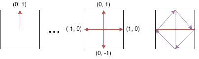

# ShapeComponents

Geometric shapes are useful in many game scenarios: debug visualizations, procedurally generated
graphics, UI elements, or simple game objects that don't need sprite art. Flame's shape components
let you render polygons, rectangles, and circles as first-class components with all the transform
properties of `PositionComponent`. They also serve as the foundation for the
[collision detection hitboxes](../collision_detection.md#shapehitbox).


A `ShapeComponent` is the base class for representing a scalable geometrical shape. The shapes have
different ways of defining how they look, but they all have a size and angle that can be modified
and the shape definition will scale or rotate the shape accordingly.

These shapes are meant as a tool for using geometrical shapes in a more general way than together
with the collision detection system, where you want to use the
[ShapeHitbox](../collision_detection.md#shapehitbox)es.


## PolygonComponent

A `PolygonComponent` is created by giving it a list of points in the constructor, called vertices.
This list will be transformed into a polygon with a size, which can still be scaled and rotated.

For example, this would create a square going from (50, 50) to (100, 100), with it's center in
(75, 75):

```dart
void main() {
  PolygonComponent([
    Vector2(100, 100),
    Vector2(100, 50),
    Vector2(50, 50),
    Vector2(50, 100),
  ]);
}
```

A `PolygonComponent` can also be created with a list of relative vertices, which are points defined
in relation to the given size, most often the size of the intended parent.

For example you could create a diamond shapes polygon like this:

```dart
void main() {
  PolygonComponent.relative(
    [
      Vector2(0.0, -1.0), // Middle of top wall
      Vector2(1.0, 0.0), // Middle of right wall
      Vector2(0.0, 1.0), // Middle of bottom wall
      Vector2(-1.0, 0.0), // Middle of left wall
    ],
    size: Vector2.all(100),
  );
}
```

The vertices in the example defines percentages of the length from the center to the edge of the
screen in both x and y axis, so for our first item in our list (`Vector2(0.0, -1.0)`) we are
pointing on the middle of the top wall of the bounding box, since the coordinate system here is
defined from
the center of the polygon.



In the image you can see how the polygon shape formed by the purple arrows is defined by the red
arrows.


## RectangleComponent

A `RectangleComponent` is created very similarly to how a `PositionComponent` is created, since it
also has a bounding rectangle.

Something like this for example:

```dart
void main() {
  RectangleComponent(
    position: Vector2(10.0, 15.0),
    size: Vector2.all(10),
    angle: pi/2,
    anchor: Anchor.center,
  );
}
```

Dart also already has an excellent way to create rectangles and that class is called `Rect`, you
can create a Flame `RectangleComponent` from a `Rect` by using the
`RectangleComponent.fromRect` factory, and just like when setting the vertices of the
`PolygonComponent`, your rectangle will be sized
according to the `Rect` if you use this constructor.

The following would create a `RectangleComponent` with its top left corner in `(10, 10)` and a size
of `(100, 50)`.

```dart
void main() {
  RectangleComponent.fromRect(
    Rect.fromLTWH(10, 10, 100, 50),
  );
}
```

You can also create a `RectangleComponent` by defining a relation to the intended parent's size,
you can use the default constructor to build your rectangle from a position, size and angle. The
`relation` is a vector defined in relation to the parent size, for example a `relation` that is
`Vector2(0.5, 0.8)` would create a rectangle that is 50% of the width of the parent's size and
80% of its height.

In the example below a `RectangleComponent` of size `(25.0, 30.0)` positioned at `(100, 100)` would
be created.

```dart
void main() {
  RectangleComponent.relative(
    Vector2(0.5, 1.0),
    position: Vector2.all(100),
    size: Vector2(50, 30),
  );
}
```

Since a square is a simplified version of a rectangle, there is also a constructor for creating a
square `RectangleComponent`, the only difference is that the `size` argument is a `double` instead
of a `Vector2`.

```dart
void main() {
  RectangleComponent.square(
    position: Vector2.all(100),
    size: 200,
  );
}
```


## CircleComponent

If you know how long your circle's position and/or how long the radius is going to be from the start
you can use the optional arguments `radius` and `position` to set those.

The following would create a `CircleComponent` with its center in `(100, 100)` with a radius of 5,
and therefore a size of `Vector2(10, 10)`.

```dart
void main() {
  CircleComponent(radius: 5, position: Vector2.all(100), anchor: Anchor.center);
}
```

When creating a `CircleComponent` with the `relative` constructor you can define how long the
radius is in comparison to the shortest edge of the of the bounding box defined by `size`.

The following example would result in a `CircleComponent` that defines a circle with a radius of 40
(a diameter of 80).

```dart
void main() {
  CircleComponent.relative(0.8, size: Vector2.all(100));
}
```
