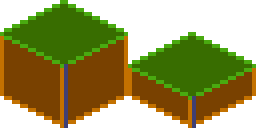
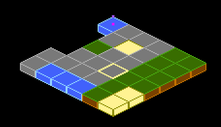

# Utility Components

Beyond the core visual components, Flame provides several utility components that handle common
game development tasks: spawning objects over time, rendering tiled maps, clipping render areas,
and bridging Flutter widgets into the game. These components save you from writing boilerplate so
you can focus on game-specific logic.


## SpawnComponent

This component is a non-visual component that spawns other components inside of the parent of the
`SpawnComponent`. It's great if you for example want to spawn enemies or power-ups randomly within
an area.

The `SpawnComponent` takes a factory function that it uses to create new components and an area
where the components should be spawned within (or along the edges of).

For the area, you can use the `Circle`, `Rectangle` or `Polygon` class, and if you want to only
spawn components along the edges of the shape set the `within` argument to false (defaults to true).

This would for example spawn new components of the type `MyComponent` every 0.5 seconds randomly
within the defined circle:

The component supports two types of factories. The `factory` returns a single component and the
`multiFactory` returns a list of components that are added in a single step.

The factory functions take an `int` as an argument, which is the number of components that have
been spawned, so if for example 4 components have been spawned already the 5th call of the factory
method will be called with the `amount=4`, since the counting starts at 0 for the first call.

The `factory` with a single component is for backward compatibility, so you should use the
`multiFactory` if in doubt. A single component `factory` will be wrapped internally to return a
single item list and then used as the `multiFactory`.

If you only want to spawn a certain amount of components, you can use the `spawnCount` argument,
and once the limit is reached the `SpawnComponent` will stop spawning and remove itself.

By default, the `SpawnComponent` will spawn components to its parent, but if you want to spawn
components to another component you can set the `target` argument. Remember that it should be a
`Component` that has a size if you don't use the `area` or `selfPositioning` arguments.


```dart
SpawnComponent(
  factory: (i) => MyComponent(size: Vector2(10, 20)),
  period: 0.5,
  area: Circle(Vector2(100, 200), 150),
);
```

If you don't want the spawning rate to be static, you can use the `SpawnComponent.periodRange`
constructor with the `minPeriod` and `maxPeriod` arguments instead.
In the following example the component would be spawned randomly within the circle and the time
between each new spawned component is between 0.5 to 10 seconds.

```dart
SpawnComponent.periodRange(
  factory: (i) => MyComponent(size: Vector2(10, 20)),
  minPeriod: 0.5,
  maxPeriod: 10,
  area: Circle(Vector2(100, 200), 150),
);
```

If you want to set the position yourself within the `factory` function, you can set
`selfPositioning = true` in the constructors and you will be able to set the positions yourself and
ignore the `area` argument.

```dart
SpawnComponent(
  factory: (i) =>
    MyComponent(position: Vector2(100, 200), size: Vector2(10, 20)),
  selfPositioning: true,
  period: 0.5,
);
```


## SvgComponent

**Note**: To use SVG with Flame, use the [`flame_svg`](https://github.com/flame-engine/flame_svg)
package.

This component uses an instance of `Svg` class to represent a Component that has an SVG that is
rendered in the game:

```dart
@override
Future<void> onLoad() async {
  final svg = await Svg.load('android.svg');
  final android = SvgComponent.fromSvg(
    svg,
    position: Vector2.all(100),
    size: Vector2.all(100),
  );
}
```


## IsometricTileMapComponent

Isometric tile maps are commonly used in strategy, simulation, and RPG games to give a 2D map a
pseudo-3D perspective. This component allows you to render an isometric map based on a cartesian
matrix of blocks and an isometric tileset.

A simple example on how to use it:

```dart
// Creates a tileset, the block ids are automatically assigned sequentially
// starting at 0, from left to right and then top to bottom.
final tilesetImage = await images.load('tileset.png');
final tileset = SpriteSheet(image: tilesetImage, srcSize: Vector2.all(32));
// Each element is a block id, -1 means nothing
final matrix = [[0, 1, 0], [1, 0, 0], [1, 1, 1]];
add(IsometricTileMapComponent(tileset, matrix));
```

It also provides methods for converting coordinates so you can handle clicks, hovers, render
entities on top of tiles, add a selector, etc.

You can also specify the `tileHeight`, which is the vertical distance between the bottom and top
planes of each cuboid in your tile. Basically, it's the height of the front-most edge of your
cuboid; normally it's half (default) or a quarter of the tile size. On the image below you can see
the height colored in the darker tone:



This is an example of what a quarter-length map looks like:



Flame's Example app contains a more in-depth example, featuring how to parse coordinates to make a
selector. The
[source code](https://github.com/flame-engine/flame/blob/main/examples/lib/stories/rendering/isometric_tile_map_example.dart)
is available on GitHub, and a
[live version](https://examples.flame-engine.org/#/Rendering_Isometric_Tile_Map)
can be viewed in the browser.


## NineTileBoxComponent

A Nine Tile Box is a rectangle drawn using a grid sprite.

The grid sprite is a 3x3 grid with 9 blocks, representing the 4 corners, the 4 sides and the
middle.

The corners are drawn at the same size, the sides are stretched on the side direction and the middle
is expanded both ways.

Using this, you can get a box/rectangle that expands well to any sizes. This is useful for making
panels, dialogs, borders.

Check the example app
[nine_tile_box](https://github.com/flame-engine/flame/blob/main/examples/lib/stories/rendering/nine_tile_box_example.dart)
for details on how to use it.


## CustomPainterComponent

A `CustomPainter` is a Flutter class used with the `CustomPaint` widget to render custom
shapes inside a Flutter application.

Flame provides a component that can render a `CustomPainter` called `CustomPainterComponent`. It
receives a custom painter and renders it on the game canvas.

This can be used for sharing custom rendering logic between your Flame game, and your Flutter
widgets.

Check the example app
[custom_painter_component](https://github.com/flame-engine/flame/blob/main/examples/lib/stories/widgets/custom_painter_example.dart)
for details on how to use it.


## ComponentsNotifier

Most of the time just accessing children and their attributes is enough to build the logic of
your game.

But sometimes, reactivity can help the developer to simplify and write better code, to help with
that Flame provides the `ComponentsNotifier`, which is an implementation of a
`ChangeNotifier` that notifies listeners every time a component is added, removed or manually
changed.

For example, let's say that we want to show a game over text when the player's lives reach zero.

To make the component automatically report when new instances are added or removed, the `Notifier`
mixin can be applied to the component class:

```dart
class Player extends SpriteComponent with Notifier {}
```

Then to listen to changes on that component the `componentsNotifier` method from `FlameGame` can
be used:

```dart
class MyGame extends FlameGame {
  int lives = 2;

  @override
  void onLoad() {
    final playerNotifier = componentsNotifier<Player>()
        ..addListener(() {
          final player = playerNotifier.single;
          if (player == null) {
            lives--;
            if (lives == 0) {
              add(GameOverComponent());
            } else {
              add(Player());
            }
          }
        });
  }
}
```

A `Notifier` component can also manually notify its listeners that something changed. Let's expand
the example above to make a HUD component blink when the player has half of their health. In
order to do so, we need the `Player` component to notify a change manually:

```dart
class Player extends SpriteComponent with Notifier {
  double health = 1;

  void takeHit() {
    health -= .1;
    if (health == 0) {
      removeFromParent();
    } else if (health <= .5) {
      notifyListeners();
    }
  }
}
```

Then our hud component could look like:

```dart
class Hud extends PositionComponent with HasGameReference {

  @override
  void onLoad() {
    final playerNotifier = game.componentsNotifier<Player>()
        ..addListener(() {
          final player = playerNotifier.single;
          if (player != null) {
            if (player.health <= .5) {
              add(BlinkEffect());
            }
          }
        });
  }
}
```

`ComponentsNotifier`s can also come in handy to rebuild widgets when state changes inside a
`FlameGame`, to help with that Flame provides a `ComponentsNotifierBuilder` widget.

To see an example of its use, check the
[ComponentsNotifier example](https://github.com/flame-engine/flame/blob/main/examples/lib/stories/components/components_notifier_example.dart).


## ClipComponent

A `ClipComponent` is a component that will clip the canvas to its size and shape. This means that
if the component itself or any child of the `ClipComponent` renders outside of the
`ClipComponent`'s boundaries, the part that is not inside the area will not be shown.

A `ClipComponent` receives a builder function that should return the `Shape` that will define the
clipped area, based on its size.

To make it easier to use that component, there are three factories that offer common shapes:

- `ClipComponent.rectangle`: Clips the area in the form of a rectangle based on its size.
- `ClipComponent.circle`: Clips the area in the form of a circle based on its size.
- `ClipComponent.polygon`:  Clips the area in the form of a polygon based on the points received
in the constructor.

Check the example app
[clip_component](https://github.com/flame-engine/flame/blob/main/examples/lib/stories/components/clip_component_example.dart)
for details on how to use it.
