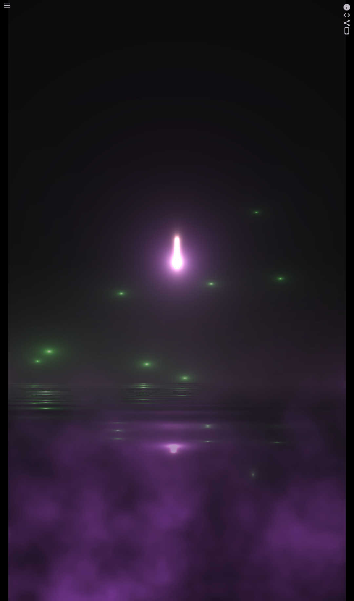

# Post Processing

Post processing is a technique used in game development to apply visual effects to a component tree
after it has been rendered. Once a frame is rendered — either directly or rasterized into an
image—post processing can modify or enhance the visuals.

Post processing leverages fragment shaders to create dynamic visual effects such as blur, bloom,
color grading, distortion, and lighting adjustments.

In Flame, the post processing system is modular and flexible, allowing developers to:

- Define custom post processes by sub-classing the abstract class `PostProcess`.
- Apply a single post process effect or chain multiple effects using groups.
- Manage effects globally with the `CameraComponent` or locally with `PostProcessComponent`.


## Key Components of the Post Processing System

- **`PostProcess`**: Abstract base class for defining custom post-processing effects. Implement
  your effect logic in its `postProcess` method.

- **`PostProcessComponent`**: Applies a post process specifically to its children, enabling
  localized effects.

- **`CameraComponent`**: Applies post processes globally to the entire scene or world.

- **`PostProcessGroup`**: Applies multiple post processes in parallel, useful when effects can be
  applied independently.

- **`PostProcessSequentialGroup`**: Applies post processes sequentially, where each process uses
  the output of the previous one.


## Creating a Custom Post Process

To implement a custom post process:

1. Subclass `PostProcess`.
2. Override the `postProcess` method, implementing your rendering logic with `renderSubtree` or
   `rasterizeSubtree`.
3. Optionally, implement `onLoad` and `update` methods for managing resources and updating effects
   each frame.

This system makes it easy to add creative and useful visual effects to your Flame game.


## Example: pixelation

Here’s an example of creating a pixelation effect using a fragment shader:

```dart
class PostProcessGame extends FlameGame {
  @override
  Future<void> onLoad() async {
    await super.onLoad();

    world.add(
      PostProcessComponent(
        postProcess: PixelationPostProcess(),
        anchor: Anchor.center,
        children: [
          EmberPlayer(size: Vector2(100, 100)),
        ],
      ),
    );
  }
}

class PixelationPostProcess extends PostProcess {
  @override
  Future<void> onLoad() async {
    await super.onLoad();

    _fragmentProgram = await FragmentProgram.fromAsset(
      'packages/flutter_shaders/shaders/pixelation.frag',
    );
  }

  late final FragmentProgram _fragmentProgram;
  late final FragmentShader _fragmentShader = _fragmentProgram.fragmentShader();

  double _time = 0;

  @override
  void update(double dt) {
    super.update(dt);
    _time += dt;
  }

  late final myPaint = Paint()..shader = _fragmentShader;

  @override
  void postProcess(Vector2 size, Canvas canvas) {
    final preRenderedSubtree = rasterizeSubtree();

    _fragmentShader.setFloatUniforms((value) {
      value
        ..setVector(size / (20 * sin(_time)))
        ..setVector(size);
    });

    _fragmentShader.setImageSampler(0, preRenderedSubtree);

    canvas
      ..save()
      ..drawRect(Offset.zero & size.toSize(), myPaint)
      ..restore();
  }
}

```

In this example:

- A fragment shader (`pixelation.frag`) is loaded and used to apply a pixelation effect.

- The `rasterizeSubtree` method captures the component tree rendering as a texture, which the
  shader uses to generate the pixelated output.

- The effect dynamically changes over time, creating an animated pixelation effect.

This example demonstrates how straightforward it is to add visual effects to your Flame game using
the post-processing system.

```{flutter-app}
:sources: ../flame/examples
:page: post_process
:show: widget code infobox
:width: 180
:height: 180
```

The pixelation shader file:

```glsl
#version 460 core

precision highp float;

#include <flutter/runtime_effect.glsl>

uniform vec2 uPixels;
uniform vec2 uSize;
uniform sampler2D uTexture;

out vec4 fragColor;

void main() {
  vec2 uv = FlutterFragCoord().xy / uSize;
  vec2 puv = round(uv * uPixels) / uPixels;
  fragColor = texture(uTexture, puv);
}
```


## Advanced Example: Crystal Ball

For a more advanced use case of post processing, check out the
[Crystal Ball example](https://examples.flame-engine.org/), which demonstrates camera-level post
processing and chaining multiple effects using `PostProcessSequentialGroup`.



Here's how multiple post-processing effects are combined on a camera:

```dart
class CrystalBallGame extends FlameGame<CrystalBallGameWorld> {

  CrystalBallGame() : super(
          camera: CameraComponent.withFixedResolution(
            width: kCameraSize.x,
            height: kCameraSize.y,
          ),
          world: CrystalBallGameWorld(),
        ) {
    camera.postProcess = PostProcessGroup(
      postProcesses: [
        PostProcessSequentialGroup(
          postProcesses: [
            FireflyPostProcess(),
            WaterPostProcess(),
          ],
        ),
        ForegroundFogPostProcess(),
      ],
    );
  }
}
```

In this code:

- The camera applies a `PostProcessGroup` containing multiple effects.
- `PostProcessSequentialGroup` chains two effects (`FireflyPostProcess` and `WaterPostProcess`)
  sequentially.
- An additional parallel effect (`ForegroundFogPostProcess`) is applied alongside the sequential
  group.

You can explore the source code [on GitHub](https://github.com/flame-engine/flame/tree/main/examples/games/crystal_ball).
