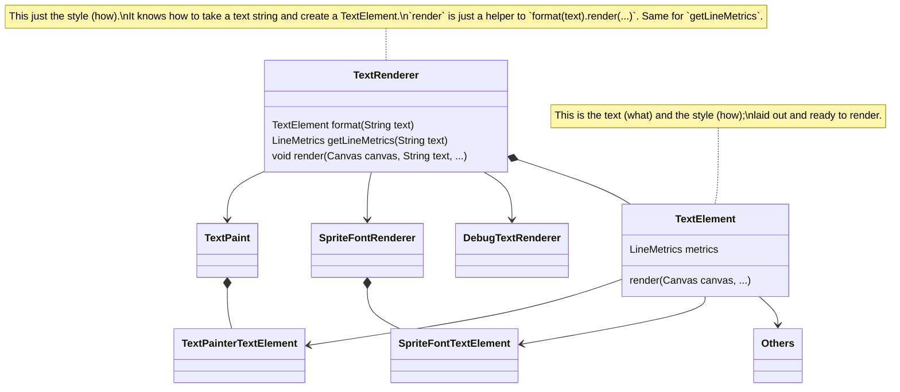

# Text Rendering

Flame has some dedicated classes to help you render text.

## Text Components

The simplest way to render text with Flame is to leverage one of the provided text-rendering components:

* `TextComponent` for rendering a single line of text
* `TextBoxComponent` for bounding multi-line text within a sized box, including the possibility of a typing effect

Both components are showcased in [this example](https://github.com/flame-engine/flame/blob/main/examples/lib/stories/rendering/text_example.dart).

### TextComponent

`TextComponent` is a simple component that renders a single line of text.

Simple usage:

```dart
class MyGame extends FlameGame {
  @override
  void onLoad() {
    add(
      TextComponent(
        text: 'Hello, Flame',
        position = Vector2.all(16.0),
      ),
    );
  }
}
```

In order to configure aspects of the rendering like font family, size, color, etc, you need to provide (or amend) a `TextRenderer` with such information; while you can read more details ab out this interface below, the simplest implementation you can use is the `TextPaint`, which takes a Flutter `TextStyle`:

```dart
final regular = TextPaint(
  style: TextStyle(
    fontSize: 48.0,
    color: BasicPalette.white.color,
  ),
);

class MyGame extends FlameGame {
  @override
  void onLoad() {
    add(
      TextComponent(
        text: 'Hello, Flame',
        textRenderer: regular,
        anchor: Anchor.topCenter,
        position: Vector2(size.width / 2, 32.0),
      ),
    );
  }
}
```

You can find all the options under [TextComponent's API](https://pub.dev/documentation/flame/latest/components/TextComponent-class.html).

### TextBoxComponent

`TextBoxComponent` is very similar to `TextComponent`, but as its name suggest it is used to render text inside a bounding box, creating line breaks according to the provided box size.

You can decide if the box should grow as the text is written or if it should be static by the `growingBox` variable in the `TextBoxConfig`. A static box could either have a fixed size (setting the `size` property of the `TextBoxComponent`), or to automatically shrink to fit the text content.

In addition, the `align` property allows you to control the the horizontal and vertical alignment of the text content. For example, setting `align` to `Anchor.center` will center the text within its bounding box both vertically and horizontally.

If you want to change the margins of the box use the `margins` variable in the `TextBoxConfig`.

Finally, if you want to simulate a "typing" effect, by showing each character of the string one by one as if being typed in real-time, you can provide the `boxConfig.timePerChar` parameter.

Example usage:

```dart
class MyTextBox extends TextBoxComponent {
  MyTextBox(String text) : super(
    text: text,
    textRenderer: tiny,
    boxConfig: TextBoxConfig(timePerChar: 0.05),
  );

  final bgPaint = Paint()..color = Color(0xFFFF00FF);
  final borderPaint = Paint()..color = Color(0xFF000000)..style = PaintingStyle.stroke;

  @override
  void render(Canvas canvas) {
    Rect rect = Rect.fromLTWH(0, 0, width, height);
    canvas.drawRect(rect, bgPaint);
    canvas.drawRect(rect.deflate(boxConfig.margin), borderPaint);
    super.render(canvas);
  }
}
```

You can find all the options under [TextBoxComponent's API](https://pub.dev/documentation/flame/latest/components/TextBoxComponent-class.html).

## Infrastructure

If you are not using the Flame Component System, want to understand the infrastructure behind text rendering, want to customize fonts and styles used, or want to create your own custom renderers, this section is for you.

* `TextRenderer`: renderers know "how" to render text; in essence they contain the style information to render any string
* `TextElement`: an element is formatted, "laid-out" piece of text, include the string ("what") and the style ("how")

The following diagram showcases the class and inheritance structure of the text rendering pipeline:



### TextRenderer

`TextRenderer` is the abstract class used by Flame to render text. Implementations of `TextRenderer` must include the information about the "how" the text is rendered. Font style, size, color, etc. It should be able to combine that information with a given string of text, via the `format` method, to generate a `TextElement`.

Flame provides two concrete implementations:

* `TextPaint`: most used, uses Flutter `TextPainter` to render regular text
* `SpriteFontRenderer`: uses a `SpriteFont` (a spritesheet-based font) to render bitmap text
* `DebugTextRenderer`: only intended to be used for Golden Tests

But you can also provide your own if you want to extend to other customized forms of text rendering.

The main job of a `TextRenderer` is to format a string of text into a `TextElement`, that then can be rendered onto the screen:

```dart
final textElement = textRenderer.format("Flame is awesome")
textElement.render(...) 
```

However the renderer provides a helper method to directly create the element and render it:

```dart
textRenderer.render(
  canvas,
  'Flame is awesome',
  Vector2(10, 10),
  anchor: Anchor.topCenter,
);
```

#### TextPaint

`TextPaint` is the built-in implementation of text rendering in Flame. It is based on top of Flutter's `TextPainter` class (hence the name), and it can be configured by the style class `TextStyle`, which contains all typographical information required to render text; i.e., font size and color, font family, etc.

Outside of the style you can also optionally provide one extra parameter which is the `textDirection` (but that is typically already set to `ltr` or left-to-right).

Example usage:

```dart
const TextPaint textPaint = TextPaint(
  style: TextStyle(
    fontSize: 48.0,
    fontFamily: 'Awesome Font',
  ),
);
```

Note: there are several packages that contain the class `TextStyle`. We export the right one (from Flutter) via the `text` module:

```dart
import 'package:flame/text.dart';
```

But if you want to import it explicitly, make sure that you import it from `package:flutter/painting.dart` (or from material or widgets).
If you also need to import `dart:ui`, you might need to hide its version of `TextStyle`, since that module contains a different class with the same name:

```dart
import 'package:flutter/painting.dart';
import 'dart:ui' hide TextStyle;
```

Some common properties of `TextStyle` are the following (here is the
[full list](https://api.flutter.dev/flutter/painting/TextStyle-class.html)):

- `fontFamily`: a commonly available font, like Arial (default), or a custom font added in your
 pubspec (see [here](https://docs.flutter.dev/cookbook/design/fonts) how to do it).
- `fontSize`: font size, in pts (default `24.0`).
- `height`: height of text line, as a multiple of font size (default `null`).
- `color`: the color, as a `ui.Color` (default white).

For more information regarding colors and how to create then, see the
[Colors and the Palette](palette.md) guide.

#### SpriteFontRenderer

The other renderer option provided out of the box is `SpriteFontRenderer`, which allows you to provide a `SpriteFont` based off of a spritesheet.
TODO

#### DebugTextRenderer

This renderer is intended to be used for Golden Tests. Rendering normal font-based text in Golden Tests is unreliable due to differences in font definitions across platforms and different algorithms used for anti-aliasing. This renderer will render text as if each word was a solid rectangle, making it possible to test the layout, positioning and sizing of the elements without having to rely on font-based rendering.

## Text Elements

Text Elements are "pre-compiled", formatted and laid-out pieces of text with a specific styling applied, ready to be rendered at any given position.

`TextElement` implements the `Element` interface and must implement their two methods, one that teaches how to translate it around and another on how to draw it to the canvas:

```dart
  void translate(double dx, double dy);
  void draw(Canvas canvas);
```

These methods are intended to be overwritten by the implementations of `TextElement` but probably will not be called directly by users; because a convenient `render` method is provided:

```dart
  void render(
    Canvas canvas,
    Vector2 position, {
    Anchor anchor = Anchor.topLeft,
  })
```

That allows the element to be rendered at a specific position, using a given anchor.

The interface also mandates (and provides) a getter for the LineMetrics object associated with that `TextElement`, which allows you (and the `render` implementation) to access sizing information related to the element (width, height, ascend, etc).

```dart
  LineMetrics get metrics;
```

## Elements, Nodes, and Styles

While normal renderers always work with TextElements directly, there is a bigger underlying infrastructure that can be used to render more rich or formatter text.

Elements are a superset of TextElements that represent an arbitrary rendering block within a rich-text document. Essentially, they are concrete and "physical": they are objects that are ready to be rendered on a canvas.

This property distinguishes them from Nodes, which are structured pieces of text, and from Styles, which are descriptors for how arbitrary pieces of text ought to be rendered.

So a user would use Node to describe a desired document of rich text; define Styles to apply to it; and use that to generate an Element. Depending on the type of rendering, the Element generated will be a TextElement, which brings us back to the normal flow of the rendering pipeline. The unique property of the Text-type element is that it exposes a LineMetrics that can be used for advanced rendering; while the other elements only expose a simpler `draw` method which is unaware of sizing and positioning.

However the other types of Elements, Nodes and Style must be used if the intent is to create an entire Document, enriched with formatted text. Currently these extra features of the system are not exposed through FCS, but can be used directly.

An example of such usages can be seen in [this example](https://github.com/flame-engine/flame/blob/main/examples/lib/stories/rendering/rich_text_example.dart).