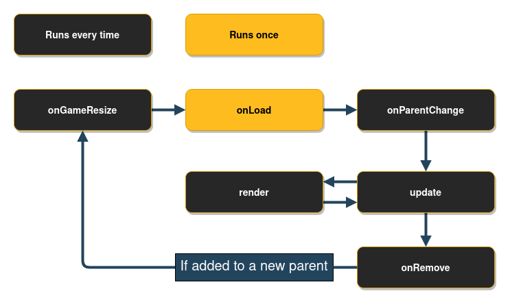
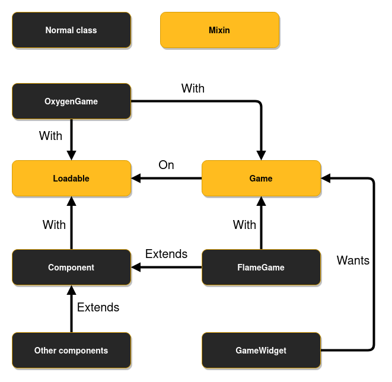

# FlameGame

`FlameGame` is the most basic and most commonly used `Game` class in Flame.

The `FlameGame` class implements a `Component` based `Game`. Basically it has a list of `Component`s
and passes the `update` and `render` calls to all `Component`s that have been added to the game.

We refer to this component based system as the Flame Component System, FCS for short.

Every time the game needs to be resized, for example when the orientation is changed,
`FlameGame` will call all of the `Component`s `resize` methods and it will also pass this information
to the camera and viewport.

The `FlameGame.camera` controls which point in the coordinate space should be the top-left of the
screen (it defaults to [0,0] like a regular `Canvas`).

A `FlameGame` implementation example can be seen below:

```dart
class MyCrate extends SpriteComponent {
  // creates a component that renders the crate.png sprite, with size 16 x 16
  MyCrate() : super(size: Vector2.all(16));

  Future<void> onLoad() async {
    sprite = await Sprite.load('crate.png');
    anchor = Anchor.center;
  }

  @override
  void onGameResize(Vector2 gameSize) {
    // We don't need to set the position in the constructor, we can it directly here since it will
    // be called once before the first time it is rendered.
    position = gameSize / 2;
  }
}

class MyGame extends FlameGame {
  MyGame() {
    add(MyCrate());
  }
}

main() {
  final myGame = MyGame();
  runApp(
    GameWidget(
      game: myGame,
    ),
  );
}
```

**Note:** If you instantiate your game in a build method your game will be rebuilt every time the
 Flutter tree gets rebuilt, which usually is more often than you'd like. To avoid this, you can
 instead create an instance of your game first and reference it within your widget structure, like
 it is done in the example above.

To remove components from the list on a `FlameGame` the `remove` or `removeAll` methods can be used.
The first can be used if you just want to remove one component, and the second can be used when you
want to remove a list of components.

Any component on which the `remove()` method has been called will also be removed. You can do this
simply by doing `yourComponent.remove();`.

## Lifecycle



When a game first is added to a Flutter widget tree the following lifecycle methods will be called
in order: `onGameResize`, `onLoad` and `onMount`. After that it goes on to call `update` and
`render` back and forth every tick, until the widget is removed from the tree.
Once the `GameWidget` is removed from the tree, `onRemove` is called, just like when a normal
component is removed from the component tree.

## Changing component priorities (render/update order)

To update a component with a new priority you have to call either `FlameGame.changePriority`, or
`FlameGame.changePriorities` if you want to change the priorities of many components at once.
This design is due to the fact that the components doesn't always have access to the component list and
because rebalancing the component list is a fairly computationally expensive operation, so you
would rather reorder the list once after all the priorities have been changed and not once for each
priority change, if you have several changes.

The higher a priority is the later it is rendered and updated, which will make it appear closer on
the screen since it will be rendered on top of any components with lower priority that were rendered
before it.

## Debug mode

Flame's `FlameGame` class provides a variable called `debugMode`, which by default is `false`. It can
however, be set to `true` to enable debug features for the components of the game. **Be aware** that
the value of this variable is passed through to its components when they are added to the game, so
if you change the `debugMode` at runtime, it will not affect already added components by default.

To read more about the `debugMode` on Flame, please refer to the [Debug Docs](debug.md)

# Low-level Game API



The `Game` mixin is a low-level API that can be used when you want to implement the functionality of
how the game engine should be structured. `Game` does not implement any `update` or
`render` function for example.

As you can see in the image above you'll have to use the `Loadable` and `Game` mixins if you want to
create your own game class, which is what is done with `OxygenGame`.

The `Loadable` mixin has the lifecycle methods `onLoad`, `onMount` and `onRemove` in it, which are
called from the `GameWidget` (or another parent) when the game is loaded + mounted, or removed.
`onLoad` is only called the first time the class is added to a parent, but `onMount` (which is
called after `onLoad`) is called every time it is added to a new parent. `onRemove` is called when
the class is removed from a parent.

**Note**: The `Game` mixin allows for more freedom of how to implement things, but you are also
missing out on all of the built-in features in Flame if you use it.

An example of how a `Game` implementation could look like:

```dart
class MyGameSubClass with Loadable, Game {
  @override
  void render(Canvas canvas) {
    // ...
  }

  @override
  void update(double t) {
    // ...
  }
}

main() {
  final myGame = MyGameSubClass();
  runApp(
    GameWidget(
      game: myGame,
    )
  );
}
```

# GameLoop

The `GameLoop` module is a simple abstraction over the game loop concept. Basically most games are
built upon two methods:

 - The render method takes the canvas for drawing the current state of the game.
 - The update method receives the delta time in seconds since the last update and allows you to move
  to the next state.

The `GameLoop` is used by all of Flame's `Game` implementations.

# Flutter Widgets and Game instances

Since a Flame game can be wrapped in a widget, it is quite easy to use it alongside other Flutter
widgets. But still, there is the Widgets Overlay API that makes things even easier.

`Game.overlays` enables any Flutter widget to be shown on top of a game instance, this makes it very
easy to create things like a pause menu or an inventory screen for example.

This management is done via the `game.overlays.add` and `game.overlays.remove` methods that marks an
overlay to be shown or hidden, respectively, via a `String` argument that identifies the overlay.
After that it can be specified which widgets represent each overlay in the `GameWidget` declaration
by setting a `overlayBuilderMap`.

```dart
// Inside the game methods:
final pauseOverlayIdentifier = 'PauseMenu';

overlays.add(pauseOverlayIdentifier); // Marks 'PauseMenu' to be rendered.
overlays.remove(pauseOverlayIdentifier); // Marks 'PauseMenu' to not be rendered.
```

```dart
// On the widget declaration
final game = MyGame();

Widget build(BuildContext context) {
  return GameWidget(
    game: game,
    overlayBuilderMap: {
      'PauseMenu': (ctx) {
        return Text('A pause menu');
      },
    },
  );
}
```

The order in which the overlays are declared in the `overlayBuilderMap` defines which order the
overlays will be rendered.

Here you can see a
[working example](https://github.com/flame-engine/flame/tree/main/examples/lib/stories/widgets/overlay.dart)
of this feature.
