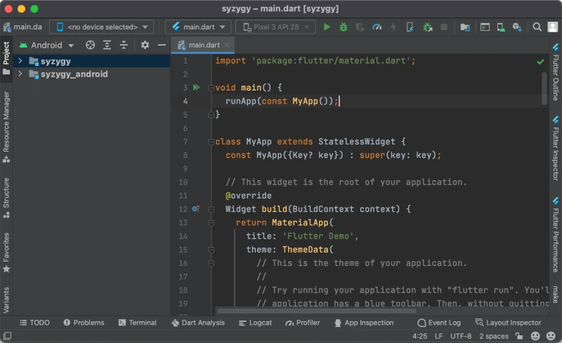
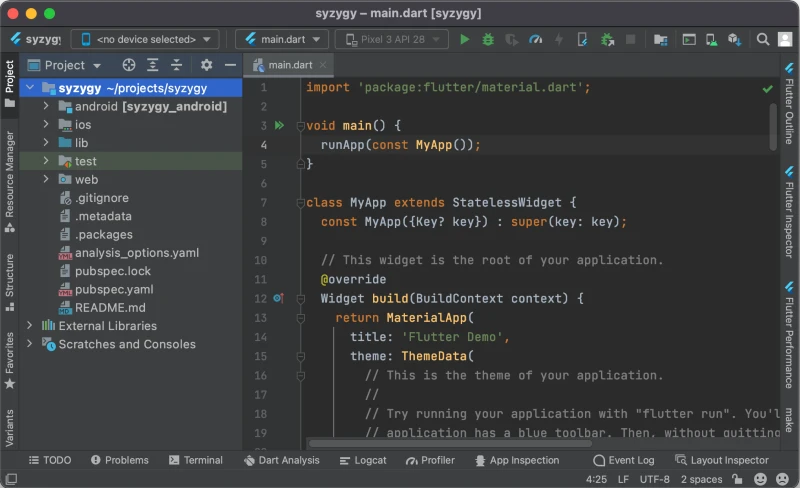

# Bare Flame game

This tutorial assumes that you have basic familiarity with using the command line, and the following
programs on your computer (all of them are free):

- [Flutter], version 3.3.0 or above.
- [Android Studio], or any other IDE for example [Visual Studio Code].
- [git] (optional), to save your project on GitHub.


## 1. Check flutter installation

First, let's verify that your Flutter SDK was installed correctly and is accessible from the command
line:

```console
$ flutter doctor
[✓] Flutter (Channel stable, 2.10.0, on macOS 12.3.1 21E258 darwin-x64, locale en)
[✓] Android toolchain - develop for Android devices (Android SDK version 31.0.0)
[✓] Xcode - develop for iOS and macOS (Xcode 13.1)
[✓] Chrome - develop for the web
[✓] Android Studio (version 2020.3)
[✓] Connected device (1 available)
[✓] HTTP Host Availability
```

Your output will be slightly different, but the important thing is to verify that no errors are
reported and that your Flutter version is at least **3.3.0**.


## 2. Create the Project Directory

Now you need to come up with a name for your project. The name can only use lowercase Latin letters,
digits, and underscores. It must also be a valid Dart identifier (thus, for example, it cannot be a
keyword). In this tutorial, we're going to call the project **syzygy**, which is a totally real
non-made-up word.

Create the directory for your new project:

```console
mkdir -p ~/projects/syzygy
cd ~/projects/syzygy
```


## 3. Initialize empty Flutter project

To turn this barren directory into an actual Flutter project, run the following command:

```console
flutter create .
```

(I have omitted the output for brevity, but there will be lots of output).

You can verify that the project files were created successfully:

```console
$ ls
README.md               android/   lib/           pubspec.yaml   test/
analysis_options.yaml   ios/       pubspec.lock   syzygy.iml     web/
```


## 4. Open the project in Android Studio

Launch Android Studio, then in the project selection window choose `[Open]` and navigate to your
project directory. With any luck, the project will now look like this:



If you see only the `main.dart` file but not the side panel, then click the vertical `[Project]`
button at the left edge of the window.

Before we proceed, let's fix the view in the left panel. Locate the button in the top left corner
that says `[Android]` in the screenshot. In this dropdown select the first option "Project". Your
project window should now look like this:



The important part is that you should be able to see all files in your project directory.


## 5. Clean up the project files

The default project created by Flutter is not very useful for making a Flame game, so we should get
rid of it.

First, open the file `pubspec.yaml` and replace it with the following code (adjusting the `name` and
`description` to match your project):

```yaml
name: syzygy
description: Syzygy Flame game
version: 0.0.0
publish_to: none

environment:
  sdk: ^2.16.0
  flutter: ^2.10.0

dependencies:
  flutter:
    sdk: flutter
  flame: ^--VERSION--
```

After that, press the `[Pub get]` button at the top of the window, or you could run command `flutter
pub get` from the terminal. This will "apply" the changes in `pubspec` file to your project, in
particular, it will download the Flame library which we have declared as a dependency. In the
future, you should run `flutter pub get` whenever you make changes to this file.

Now, open the file `lib/main.dart` and replace its content with the following:

```dart
import 'package:flame/game.dart';
import 'package:flutter/widgets.dart';

void main() {
  final game = FlameGame();
  runApp(GameWidget(game: game));
}
```

Lastly, remove the file `test/widget_test.dart` completely.


## 6. Run the project

Let's verify that everything is working as intended, and the project can run.

In the menu bar at the top of the window find a dropdown that says `<no device selected>`. In that
dropdown choose `<Chrome (web)>` instead.

After that open the `main.dart` file and press the green arrow next to the `void main()` function in
line 4. Select `[Run main.dart]` from the menu.

This should open a new Chrome window (which may take 10-30 seconds) and run your project in that
window. For now, it will simply show a black screen, which is expected because we created the game
in its simplest blank configuration.


## 7. Sync to GitHub

The last step is to upload your project to GitHub. This is not required but strongly recommended as
it will serve as a backup for your code. This step assumes that you already have a GitHub account.

Log into your GitHub account, select `[Your repositories]` from your profile dropdown, and press the
green `[New]` button. In the form, enter the repository name the same as your project name; select
type "private"; and opt out of adding initial files like `README`, `license`, and `.gitignore`.

Now go to your project's directory in the terminal and execute the following commands (make sure to
replace the URL with the link to the repository that you just created):

```console
git init
git add --all
git commit -m 'Initial commit'
git remote add origin https://github.com/your-github-username/syzygy.git
git branch -M main
git push -u origin main
```

At this point, if you go to your repository page on GitHub, you shall see that all your project
files are there.


## 8. Done

That's it! By this point you have

- Created an initial blank state Flame project;
- Set up the Android Studio IDE for that project;
- Created a GitHub repository for the project.

Happy coding!


[Flutter]: https://docs.flutter.dev/get-started/install
[git]: https://git-scm.com/downloads
[Android Studio]: https://developer.android.com/studio
[Visual Studio Code]: https://code.visualstudio.com/download
