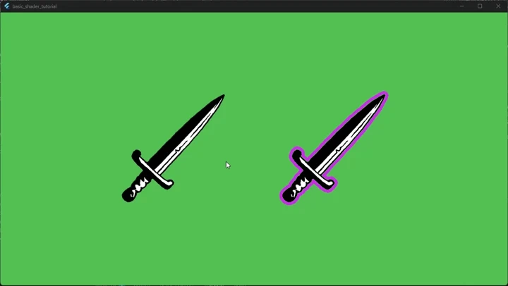

# Appendix A - User input

This section we will add a Flame ```mixin``` to handle some mouse hover events
and change the underlying shader behavior.  


## **A.1** **Event handling**  

Open the ```sword_component.dart``` file or where your
```PostProcessComponent``` is located.  
Add the ```HoverCallbacks``` mixin to the class, to have something like this:

```dart
//... other imports
import 'package:flame/events.dart';

class SwordSpritePostProcessed extends PostProcessComponent with HoverCallbacks {
    //... omitted for brevity
}
```

After that add one private field and the two function to react to hover enter
and exit into the class.  
(The cancel event should be handled too but for clarity, I omitted).  

```dart
Color? _originalPostProcessColor;

@override
void onHoverEnter() {
    super.onHoverEnter();
    
    final OutlinePostProcess outlinePostProcess = postProcess as OutlinePostProcess;
    _originalPostProcessColor = outlinePostProcess.outlineColor;
    outlinePostProcess.outlineColor = Colors.blue;
}

@override
void onHoverExit() {
    final OutlinePostProcess outlinePostProcess = postProcess as OutlinePostProcess;
    outlinePostProcess.outlineColor = _originalPostProcessColor ?? Colors.purpleAccent;

    super.onHoverExit();
}
```

At this point the solution was not working for me with these modifications.  

As I debugged, I found out the size property of ```PostProcessComponent``` was
not handled as I expected, though the value of size property was not a zero
vector at runtime.  

I decided to elevate some part of the code from ```PostProcessComponent```
into ```SwordSpritePostProcessed``` and handle the children changing there.  

After I explicitly set the size property it was working as intended, attached
to ```onChildrenChanged``` event to let it work with multiple children
(but not tested that part).  

After that the expected bounding box became the target.  

At the end the ```sword_component.dart``` file became this:

```dart
import 'dart:async';

import 'package:flame/components.dart';
import 'package:flame/post_process.dart';

import 'package:basic_shader_tutorial/outline_postprocess.dart';

// Appendix: A 
/**/
import 'package:flame/events.dart';
import 'package:flutter/material.dart';
/**/

class SwordSpritePostProcessed extends PostProcessComponent 
// Appendix A:
/**/
with HoverCallbacks 
/**/
{
  SwordSpritePostProcessed({super.position, super.anchor})
  : super(
    children: [SwordSprite()],
    postProcess: OutlinePostProcess(anchor: anchor ?? Anchor.topLeft),
  );

  // Appendix A:
  /**/
  @override
  void onChildrenChanged(Component component, ChildrenChangeType changeType) {
    _recalculateBoundingSize();

    super.onChildrenChanged( component, changeType);
  }
  
  // I have to recalculate the size property manually,
  // it was not working without it
  // Even if the code is the similar in the super class.
  void _recalculateBoundingSize() {
    final Vector2 boundingBox = Vector2.zero();
    
    final rectChildren = children.query<PositionComponent>();
    if( !rectChildren.isEmpty ){
      final boundingRect = rectChildren
        .map((child) => child.toRect())
        .reduce((a, b) => a.expandToInclude(b))
      ;

      boundingBox.setValues(boundingRect.width, boundingRect.height);
    }
    
    size = boundingBox;
  }

  Color? _originalPostProcessColor;

  @override
  void onHoverEnter() {
    super.onHoverEnter();
    
    final OutlinePostProcess outlinePostProcess = postProcess as OutlinePostProcess;
    _originalPostProcessColor = outlinePostProcess.outlineColor;
    outlinePostProcess.outlineColor = Colors.blue;
  }

  @override
  void onHoverExit() {
    final OutlinePostProcess outlinePostProcess = postProcess as OutlinePostProcess;
    outlinePostProcess.outlineColor = _originalPostProcessColor ?? Colors.purpleAccent;
    
    super.onHoverExit();
  }
  /**/
  
}

class SwordSprite extends SpriteComponent{
  @override
  Future<void> onLoad() async {
    sprite = await Sprite.load('sword.png');
    size = sprite!.srcSize;

    return super.onLoad();
  }
}
```

The result is, when you hover over the sprite bounding box, the outline shader
changes to blue, because we set the uniform variable in the hover event.  
If the mouse exits the box, then it will change back to the original color.  

This is how it should look like:  


That is the end of Appendix A.
