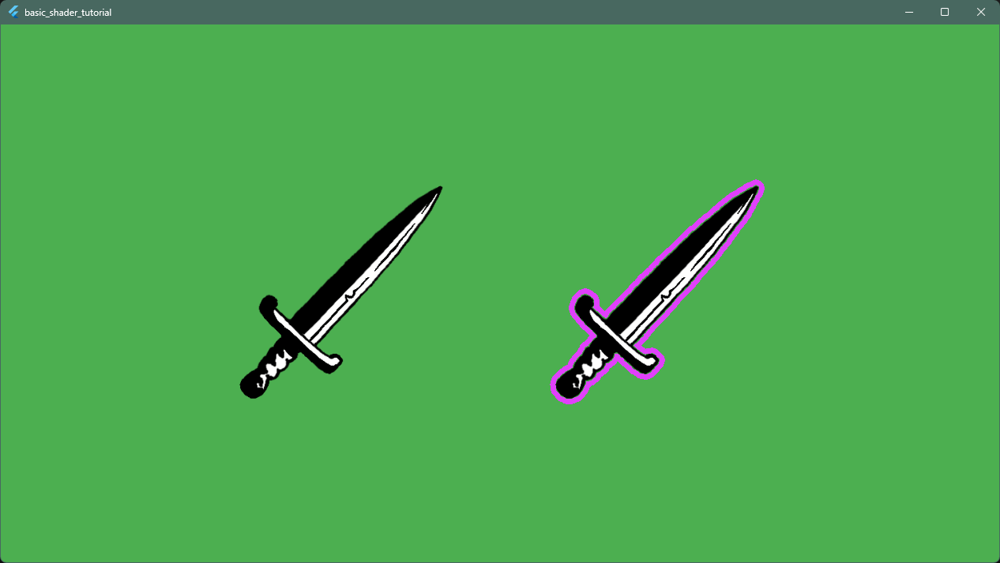

# Shader


## 3.0 Considerations

In this section we will create the fragment (pixel) shader program which runs
on the GPU, then add it as a resource.

It is important to note, we are going to program the GPU, so this code will
need a little bit of different thinking from what we did before.

```{note}
The fragment shader runs for each pixel. Be mindful of branching and looping as
operations scale linearly with pixel count and loop iterations per frame.
```

```{note}
Shader optimization is out of the scope of this tutorial.
But there are guards, to escape as early as possible.

Instead of square root, it would be a better solution to compare squared
values only.
```

Everything is ready to create the GLSL based shader.


## 3.1 Shader code

Create a new directory at `assets/shaders/` and a file named `outline.frag`.

Open the `outline.frag` file and add the following lines:

```glsl
#version 460 core

precision mediump float;

#include <flutter/runtime_effect.glsl>

uniform vec2 uSize;
uniform float uOutlineWidth;
uniform vec4 uOutlineColor;
uniform sampler2D uTexture;

const int MAX_SAMPLE_DISTANCE = 8;

out vec4 fragColor;

void main() {
  vec2 uv = FlutterFragCoord().xy / uSize;
  vec4 texColor = texture(uTexture, uv);

  // If the current pixel is not transparent, render the original color
  if (texColor.a > 0.0) {
    fragColor = texColor;
    return;
  }

  // Check surrounding pixels for outline
  vec2 texelSize = 1.0 / uSize;
  bool foundOpaqueNearby = false;

  // Sample in the bounding square pattern around the current pixel
  // You must use static const loop counts in GLSL
  for (int x = -MAX_SAMPLE_DISTANCE; x <= MAX_SAMPLE_DISTANCE; x++) {
    for (int y = -MAX_SAMPLE_DISTANCE; y <= MAX_SAMPLE_DISTANCE; y++) {
      if (x == 0 && y == 0) continue;

      // Checking the real distance, instead of square based (manhattan) distance
      float distance = sqrt(float( x*x + y*y ));
      if (distance > uOutlineWidth) continue;

      // Sample the shifted pixel from the current pixel (uv)
      vec2 offset = vec2(float(x), float(y)) * texelSize;
      vec4 sampleColor = texture(uTexture, uv + offset);

      if (sampleColor.a > 0.0) {
        // We found solid color in the iteration --> sprite is nearby
        foundOpaqueNearby = true;
        break;
      }
    }
    // Also break out from outer loop, if found a solid color next to current pixel
    if (foundOpaqueNearby) break;
  }

  if (foundOpaqueNearby) {
    fragColor = uOutlineColor;
  } else {
    fragColor = vec4(0.0, 0.0, 0.0, 0.0);
  }
}
```

*So.. what does this shader do?*
Grabbing each transparent pixel and checking: is it next to an opaque pixel?
If yes, then color it as the outline color (passed in as a uniform variable),
else it will be full transparent.

That is why the transparency of the `.png` image was important in the
beginning.

```{note}
The loop of a GLSL shader accepts only a compile time constant.
So the outline width uniform cannot be used as the loop bound. This means
`MAX_SAMPLE_DISTANCE` should be set accordingly in the shader code.
```


## 3.2 Shader resource

To let Flutter know about this shader asset we have to add
it to the `pubspec.yaml` file before compilation.

Open the `pubspec.yaml` and write the following lines under what we already added:

```yaml
flutter:
  assets:
    - assets/images/
  shaders:
    - assets/shaders/outline.frag
```

Save it and let the automatic `pub get` command run.
Now the resource will be loaded when the project is next compiled.

Run the application.

*Voila!*
You should see two sprites in the window.
The left is without an outline, the right one is with a colored outline from
the shader.



We are done with the basic shader tutorial.
*Cool!*

It's time for you to experiment!
