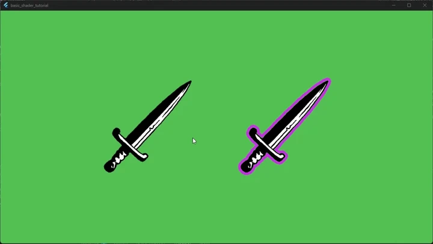

# 4. User Input

In this section we will add a Flame `mixin` to handle some mouse hover events
and change the underlying shader behavior.


## Event handling

Open the `sword_component.dart` file or where your
`PostProcessComponent` is located.
Add the `HoverCallbacks` mixin to the class, to have something like this:

```dart
import 'package:flame/events.dart';

class SwordSpritePostProcessed extends PostProcessComponent
    with HoverCallbacks {
  // ...
}
```

After that add one private field and the two functions to react to hover enter
and exit into the class.
(The cancel event should be handled too but for clarity, I omitted it).

```dart
Color? _originalPostProcessColor;

@override
void onHoverEnter() {
  super.onHoverEnter();

  final outlinePostProcess = postProcess as OutlinePostProcess;
  _originalPostProcessColor = outlinePostProcess.outlineColor;
  outlinePostProcess.outlineColor = Colors.blue;
}

@override
void onHoverExit() {
  final outlinePostProcess = postProcess as OutlinePostProcess;
  outlinePostProcess.outlineColor =
      _originalPostProcessColor ?? Colors.purpleAccent;

  super.onHoverExit();
}
```


## Full solution

At the end the `sword_component.dart` file becomes this:

```dart
import 'package:flutter/material.dart';

import 'package:flame/components.dart';
import 'package:flame/events.dart';
import 'package:flame/post_process.dart';

import 'package:basic_shader_tutorial/outline_postprocess.dart';

class SwordSpritePostProcessed extends PostProcessComponent
    with HoverCallbacks {
  SwordSpritePostProcessed({super.position, super.anchor})
    : super(
        children: [SwordSprite()],
        postProcess: OutlinePostProcess(anchor: anchor ?? Anchor.topLeft),
      );

  @override
  void onChildrenChanged(
    Component component,
    ChildrenChangeType changeType,
  ) {
    _recalculateBoundingSize();
    super.onChildrenChanged(component, changeType);
  }

  void _recalculateBoundingSize() {
    final boundingBox = Vector2.zero();

    final rectChildren = children.query<PositionComponent>();
    if (rectChildren.isNotEmpty) {
      final boundingRect = rectChildren
          .map((child) => child.toRect())
          .reduce((a, b) => a.expandToInclude(b));

      boundingBox.setValues(boundingRect.width, boundingRect.height);
    }

    size = boundingBox;
  }

  Color? _originalPostProcessColor;

  @override
  void onHoverEnter() {
    super.onHoverEnter();

    final outlinePostProcess = postProcess as OutlinePostProcess;
    _originalPostProcessColor = outlinePostProcess.outlineColor;
    outlinePostProcess.outlineColor = Colors.blue;
  }

  @override
  void onHoverExit() {
    final outlinePostProcess = postProcess as OutlinePostProcess;
    outlinePostProcess.outlineColor =
        _originalPostProcessColor ?? Colors.purpleAccent;

    super.onHoverExit();
  }
}

class SwordSprite extends SpriteComponent {
  @override
  Future<void> onLoad() async {
    sprite = await Sprite.load('sword.png');
    size = sprite!.srcSize;
  }
}
```

The result is, when you hover over the sprite bounding box, the outline shader
changes to blue, because we set the uniform variable in the hover event.
If the mouse exits the box, then it will change back to the original color.

This is how it should look:

