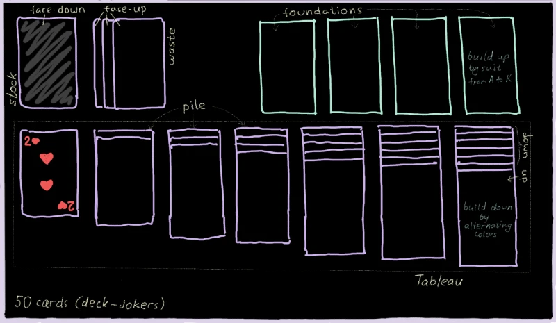
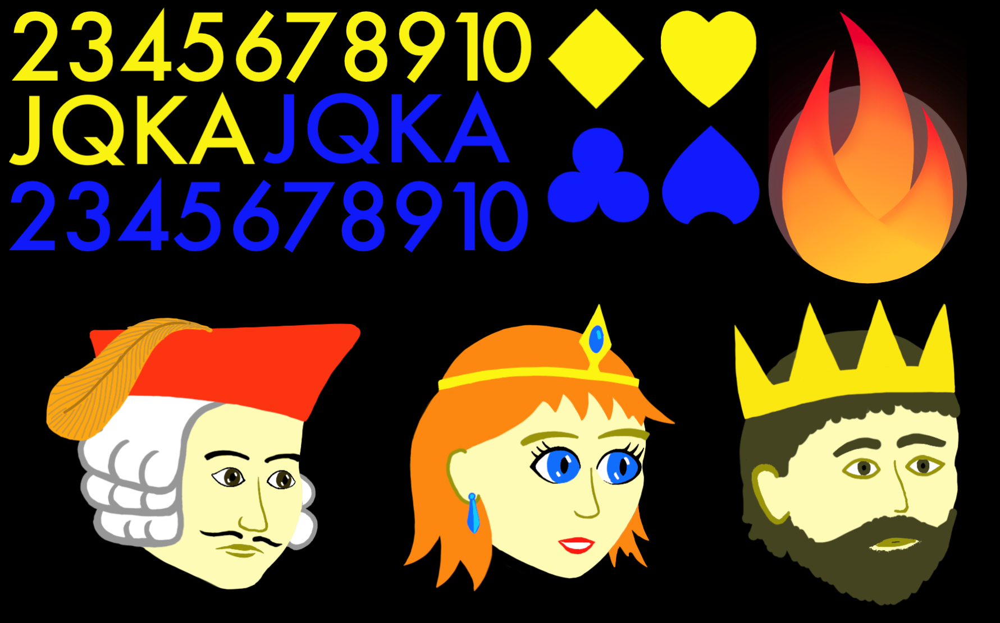

# 1. Preparation

Before you begin any kind of game project, you need to give it a **name**. For
this tutorial the name will be simply `klondike`.

Having this name in mind, please head over to the [](../bare_flame_game.md)
tutorial and complete the necessary set up steps. When you come back, you should
already have the `main.dart` file with the following content:

```dart
import 'package:flame/game.dart';
import 'package:flutter/widgets.dart';

void main() {
  final game = FlameGame();
  runApp(GameWidget(game: game));
}
```


## Planning

The start of any project usually feels overwhelming. Where even to begin?
I always find it useful to create a rough sketch of what I am about to code,
so that it can serve as a reference point. My sketch for the Klondike game is
shown below:



Here you can see both the general layout of the game, as well as names of
various objects. These names are the [standard terminology] for solitaire games.
Which is really lucky, because normally figuring out good names for various
classes is quite a challenging task.

Looking at this sketch, we can already imagine the high-level structure of the
game. Obviously, there will be a `Card` class, but also the `Stock` class, the
`Waste` class, a `Tableau` containing seven `Pile`s, and 4 `Foundation`s. There
may also be a `Deck`. All of these components will be tied together via the
`KlondikeGame` derived from the `FlameGame`.


## Assets

Another important aspect in any game development is the game's assets. These
includes images, sprites, animations, sounds, textures, data files, and so on.
In such a simple game as Klondike we won't need lots of fancy graphics, but
still some sprites will be needed in order to draw the cards.

In order to prepare the graphic assets, I first took a physical playing card and
measured it to be 63mm × 88mm, which is the ratio of approximately `10:14`.
Thus, I decided that my in-game cards should be rendered at 1000×1400 pixels,
and I should draw all my images with this scale in mind.

Note that the exact pixel dimensions are somewhat irrelevant here, since the
images will in the end be scaled up or down, according to the device's actual
resolution. Here I'm using probably a bigger resolution than necessary for
phones, but it would also work nicely for larger devices like an iPad.

And now, without further ado, here's my graphic asset for the Klondike game
(I'm not an artist, so don't judge too harshly):



Right-click the image, choose "Save as...", and store it in the `assets/images`
folder of the project. At this point our project's structure looks like this
(there are other files too, of course, but these are the important ones):

```text
klondike/
 ├─assets/
 │  └─images/
 │     └─klondike-sprites.png
 ├─lib/
 │  └─main.dart
 └─pubspec.yaml
```

By the way, this kind of file is called the **spritesheet**: it's just a
collection of multiple independent images in a single file. We are using a
spritesheet here for the simple reason that loading a single large image is
faster than many small images. In addition, rendering sprites that were
extracted from a single source image can be faster too, since Flutter will
optimize multiple such drawing commands into a single `drawAtlas` command.

Here are the contents of my spritesheet:

- Numerals 2, 3, 4, ..., K, A. In theory, we could have rendered these in the
    game as text strings, but then we would need to also include a font as an
    asset -- seems simpler to just have them as images instead.
- Suit marks: ♥, ♦, ♣, ♠. Again, we could have used Unicode characters for
    these, but images are much easier to position precisely.
  - In case you're wondering why these are yellow/blue instead of red/black
        -- turns out, black symbols don't look very nice on a dark background,
        so I had to adjust the color scheme.
- Flame logo, for use on the backs of the cards.
- Pictures of a Jack, a Queen, and a King. Normally there would be four times
    more of these, with a different character for each suite, but I got too
    tired drawing these.

Also, you need to tell Flutter about this image (just having it inside the
`assets` folder is not enough). In order to do this, let's add the following
lines into the `pubspec.yaml` file:

```yaml
flutter:
  assets:
    - assets/images/
```

Alright, enough with preparing -- onward to coding!


[standard terminology]: https://en.wikipedia.org/wiki/Solitaire_terminology
