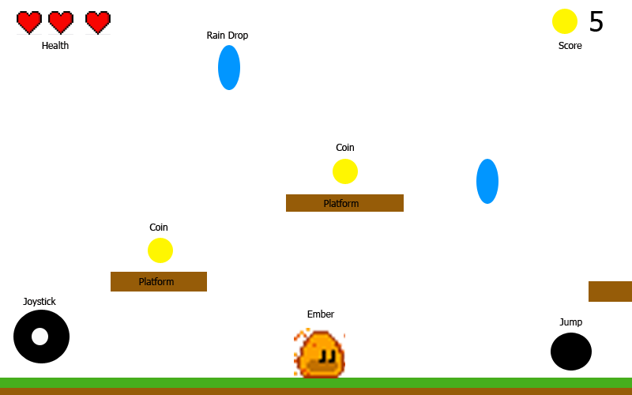

# 1. Preparation

Before you begin any kind of game project, you need to give it a **name**. For this tutorial, the
name will be simply `EmberEscapades`.

Having this name in mind, please head over to the [](../bare_flame_game.md)
 tutorial and complete the necessary setup steps. When you come back, you should
already have the `main.dart` file with the following content:

```dart
import 'package:flame/game.dart';
import 'package:flutter/widgets.dart';

void main() {
  final game = FlameGame();
  runApp(GameWidget(game: game));
}
```


## Planning

Like in the [klondike](../klondike/klondike.md) tutorial, starting a new game can feel overwhelming.
Starting with a simple sketch (it doesn't have to be perfect as mine is very rough) is the best way
to get an understanding of what we will need to accomplish.  Take for instance the below sketch, we
know we will need the
following:

- Player Class
- Player Data Class (this will handle health and coin count)
- Coin Class
- Platform Class
- Rain Drop Class
- HUD Controls Class



All of these will be brought together in `EmberEscapadesGame` derived from `FlameGame`.
