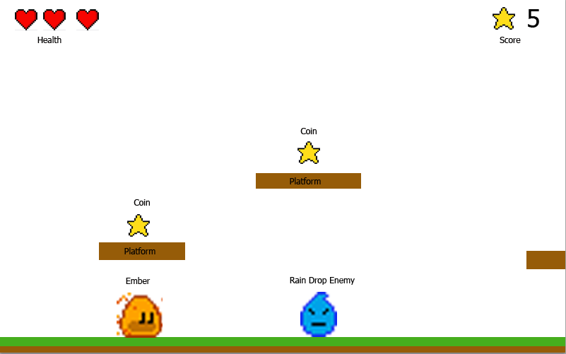

# 1. Preparation

Before you begin any kind of game project, you need an idea of what you want to make and I like to
then give it a **name**. For this tutorial and game, Ember will be on a quest to gather as many
(GitHub) stars as possible and I will call the game, `Ember Quest`.

Now it is time to get started, but first you need to go to the [bare flame game
tutorial](../bare_flame_game.md) and complete the necessary setup steps. When you come back, you
should already have the `main.dart` file with the following content:

```dart
import 'package:flame/game.dart';
import 'package:flutter/widgets.dart';

void main() {
  final game = FlameGame();
  runApp(GameWidget(game: game));
}
```


## Planning

Like in the [klondike](../klondike/klondike.md) tutorial, starting a new game can feel overwhelming.
I like to first decide what platform I am trying to target. Will this be a mobile game, a desktop
game, or maybe a web game, with Flutter and Flame, these are all possible.  For this game though, I
am going to focus on a web game. This means my users will interact with the game using their
keyboards.

Starting with a simple sketch (it doesn't have to be perfect as mine is very rough) is
the best way to get an understanding of what will need to be accomplished. For the sketch below,
we know we will need the following:

- Player Class
- Enemy Class
- Star Class
- Platform Class
- Ground Class
- HUD Class (health and stars collected)



All of these will be brought together in `EmberQuestGame` derived from `FlameGame`.


## Assets

Every game needs assets.  Assets are images, sprites, animations, sounds, etc. Now, I am not an
artist, but because I am basing this game on Ember, the flame mascot, and Ember is already designed,
it sets the tone that this will be a pixel art game.  There are numerous sites available that
provide free pixel art that can be used in games, but please check and comply with the licensing and
always provide valid creator attribution.  For this game though, I am going to take a chance and
make my artwork using an online pixel art tool.  If you decide to use this tool, multiple online
tutorials will assist you with the basic operations as well as exporting the assets.  Now normally,
most games will utilize spritesheets.  These combine many images into one larger image that can be
sectioned and used as individual images.  For this tutorial though, I specifically will save the
images individually as I want to demonstrate the Flame engine's caching abilities.  Ember and the
water enemy are spritesheets though as they contain multiple images to create animations.

Right-click the images below, choose "Save as...", and store them in the `assets/images` folder of the
project. At this point our project's structure looks like this:

```text
emberquest/
 ├─assets/
 │  └─images/
 │     ├─block.png
 │     ├─ember.png
 │     ├─ground.png
 │     ├─heart_half.png
 │     ├─heart.png
 │     ├─star.png
 │     └─water_enemy.png
 ├─lib/
 │  └─main.dart
 └─pubspec.yaml
```


```{note}
You may ask, why are the images different sizes?

As I was using the online tool to make the assets, I had trouble getting the
detail I desired for the game in a 16x16 block.  The heart worked out in 32x32 
and the ground as well as the star were 64x64.  Regardless, the asset size does
not matter for the game as we will resize as needed.
```

Also, you need to tell Flutter about these images (just having them inside the `assets` folder is
not enough). To do this, let's add the following lines into the `pubspec.yaml` file:

```yaml
flutter:
  assets:
    - assets/images/
```

Alright, enough with preparing -- onward to coding!
