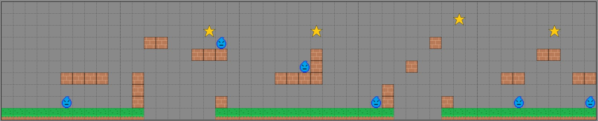
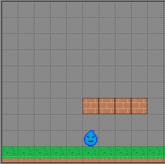
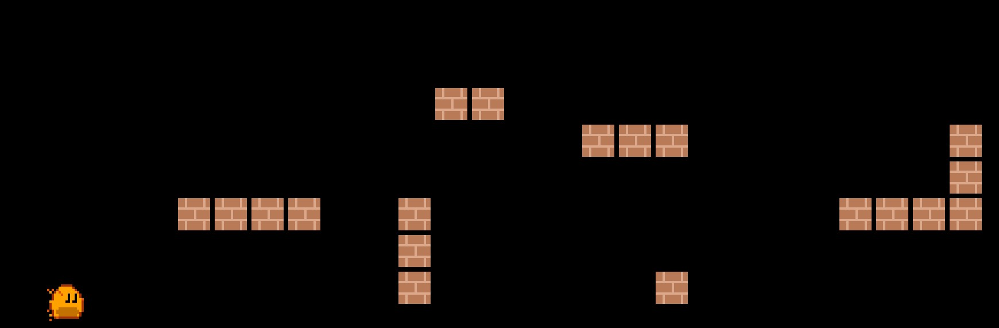

# 3. Building the World


## Creating Segments

For this world to be infinite, the best way to approach this is to create segments that can be
reloaded over and over.  To do this, we need a rough sketch of what our level segments will look
like. I have created the following sketch to show what the segments would look like and how they can
be repeated:



Each segment is a 10x10 grid and each block is 64 pixels x 64 pixels.  This means Ember Quest has a
height of 640 with an infinite width.  In my design, there must always be a ground
block at the beginning and the end.  Additionally, there must be at least 3 ground blocks that come
before an enemy, including if the segment wraps to another segment.  This is because the plan is to
have the enemies traverse back and forth for 3 blocks. Now that we have a plan for the segments,
let's create a segment manager class.


### Segment Manager

To get started, we have to understand that we will be referencing our blocks in the segment manager,
so first create a new folder called `lib/objects`.  In that folder, create 3 files called
`ground_block.dart`, `platform_block.dart`, and `star.dart`.  Those files just need basic
boilerplate code for the class, so create the following in their respective files:

```dart
class GroundBlock{}

class PlatformBlock{}

class Star{}
```

Also, create `water_enemy.dart` in the `lib/actors` folder using this boilerplate code:

```dart
class WaterEnemy{}
```

Now we can create a file called `segment_manager.dart` which will be placed in a new folder called
`lib/managers`.  The segment manager is the heart and soul, if you will, of Ember Quest.  This is
where you can get as creative as you want.  You do not have to follow my design, just remember that
whatever you design, the segment must follow the rules outlined above. Add the following code to
`segment_manager.dart`:

```dart
class Block {
  // gridPosition position is always segment based X,Y.
  // 0,0 is the bottom left corner.
  // 10,10 is the upper right corner.
  final Vector2 gridPosition;
  final Type blockType;
  Block(this.gridPosition, this.blockType);
}

final segments = [
  segment0,
];

final segment0 = [

];
```

So what this does, is allows us to create segments (segment0, segment1, etc) in a list format that
gets added to the `segments` list.  The individual segments will be made up of multiple entries of the
`Block` class.  This information will allow us to translate the block position from a 10x10 grid to
the actual pixel position in the game world.  To create a segment, you need to create
entries for each block that you wish to be rendered from the sketch.

To understand each segment, if we start in the bottom left corner of the grid in the sketch, we see
that we should place a `Block()` in the `segment0` list with a first parameter `gridPosition` of a
`Vector2(0,0)` and a `blockType` of the `GroundBlock` class that we created earlier.  Remember, the
very bottom left cell is x=0 and y=0 thus the `Vector2(x,y)` is `Vector2(0,0)`.



The full segment would look like this:

```dart
final segment0 = [
  Block(Vector2(0, 0), GroundBlock),
  Block(Vector2(1, 0), GroundBlock),
  Block(Vector2(2, 0), GroundBlock),
  Block(Vector2(3, 0), GroundBlock),
  Block(Vector2(4, 0), GroundBlock),
  Block(Vector2(5, 0), GroundBlock),
  Block(Vector2(5, 1), WaterEnemy),
  Block(Vector2(5, 3), PlatformBlock),
  Block(Vector2(6, 0), GroundBlock),
  Block(Vector2(6, 3), PlatformBlock),
  Block(Vector2(7, 0), GroundBlock),
  Block(Vector2(7, 3), PlatformBlock),
  Block(Vector2(8, 0), GroundBlock),
  Block(Vector2(8, 3), PlatformBlock),
  Block(Vector2(9, 0), GroundBlock),
];
```

Proceed to build the remaining segments.  The full segment manager should look like this:

```dart
import 'package:flame/components.dart';

import '../actors/water_enemy.dart';
import '../objects/ground_block.dart';
import '../objects/platform_block.dart';
import '../objects/star.dart';

class Block {
  // gridPosition position is always segment based X,Y.
  // 0,0 is the bottom left corner.
  // 10,10 is the upper right corner.
  final Vector2 gridPosition;
  final Type blockType;
  Block(this.gridPosition, this.blockType);
}

final segments = [
  segment0,
  segment1,
  segment2,
  segment3,
  segment4,
];

final segment0 = [
  Block(Vector2(0, 0), GroundBlock),
  Block(Vector2(1, 0), GroundBlock),
  Block(Vector2(2, 0), GroundBlock),
  Block(Vector2(3, 0), GroundBlock),
  Block(Vector2(4, 0), GroundBlock),
  Block(Vector2(5, 0), GroundBlock),
  Block(Vector2(5, 1), WaterEnemy),
  Block(Vector2(5, 3), PlatformBlock),
  Block(Vector2(6, 0), GroundBlock),
  Block(Vector2(6, 3), PlatformBlock),
  Block(Vector2(7, 0), GroundBlock),
  Block(Vector2(7, 3), PlatformBlock),
  Block(Vector2(8, 0), GroundBlock),
  Block(Vector2(8, 3), PlatformBlock),
  Block(Vector2(9, 0), GroundBlock),
];

final segment1 = [
  Block(Vector2(0, 0), GroundBlock),
  Block(Vector2(1, 0), GroundBlock),
  Block(Vector2(1, 1), PlatformBlock),
  Block(Vector2(1, 2), PlatformBlock),
  Block(Vector2(1, 3), PlatformBlock),
  Block(Vector2(2, 6), PlatformBlock),
  Block(Vector2(3, 6), PlatformBlock),
  Block(Vector2(6, 5), PlatformBlock),
  Block(Vector2(7, 5), PlatformBlock),
  Block(Vector2(7, 7), Star),
  Block(Vector2(8, 0), GroundBlock),
  Block(Vector2(8, 1), PlatformBlock),
  Block(Vector2(8, 5), PlatformBlock),
  Block(Vector2(8, 6), WaterEnemy),
  Block(Vector2(9, 0), GroundBlock),
];

final segment2 = [
  Block(Vector2(0, 0), GroundBlock),
  Block(Vector2(1, 0), GroundBlock),
  Block(Vector2(2, 0), GroundBlock),
  Block(Vector2(3, 0), GroundBlock),
  Block(Vector2(3, 3), PlatformBlock),
  Block(Vector2(4, 0), GroundBlock),
  Block(Vector2(4, 3), PlatformBlock),
  Block(Vector2(5, 0), GroundBlock),
  Block(Vector2(5, 3), PlatformBlock),
  Block(Vector2(5, 4), WaterEnemy),
  Block(Vector2(6, 0), GroundBlock),
  Block(Vector2(6, 3), PlatformBlock),
  Block(Vector2(6, 4), PlatformBlock),
  Block(Vector2(6, 5), PlatformBlock),
  Block(Vector2(6, 7), Star),
  Block(Vector2(7, 0), GroundBlock),
  Block(Vector2(8, 0), GroundBlock),
  Block(Vector2(9, 0), GroundBlock),
];

final segment3 = [
  Block(Vector2(0, 0), GroundBlock),
  Block(Vector2(1, 0), GroundBlock),
  Block(Vector2(1, 1), WaterEnemy),
  Block(Vector2(2, 0), GroundBlock),
  Block(Vector2(2, 1), PlatformBlock),
  Block(Vector2(2, 2), PlatformBlock),
  Block(Vector2(4, 4), PlatformBlock),
  Block(Vector2(6, 6), PlatformBlock),
  Block(Vector2(7, 0), GroundBlock),
  Block(Vector2(7, 1), PlatformBlock),
  Block(Vector2(8, 0), GroundBlock),
  Block(Vector2(8, 8), Star),
  Block(Vector2(9, 0), GroundBlock),
];

final segment4 = [
  Block(Vector2(0, 0), GroundBlock),
  Block(Vector2(1, 0), GroundBlock),
  Block(Vector2(2, 0), GroundBlock),
  Block(Vector2(2, 3), PlatformBlock),
  Block(Vector2(3, 0), GroundBlock),
  Block(Vector2(3, 1), WaterEnemy),
  Block(Vector2(3, 3), PlatformBlock),
  Block(Vector2(4, 0), GroundBlock),
  Block(Vector2(5, 0), GroundBlock),
  Block(Vector2(5, 5), PlatformBlock),
  Block(Vector2(6, 0), GroundBlock),
  Block(Vector2(6, 5), PlatformBlock),
  Block(Vector2(6, 7), Star),
  Block(Vector2(7, 0), GroundBlock),
  Block(Vector2(8, 0), GroundBlock),
  Block(Vector2(8, 3), PlatformBlock),
  Block(Vector2(9, 0), GroundBlock),
  Block(Vector2(9, 1), WaterEnemy),
  Block(Vector2(9, 3), PlatformBlock),
];
```


### Loading the Segments into the World

Now that our segments are defined, we need to create a way to load these blocks into our world.  To
do that, we are going to start work in the `ember_quest.dart` file.  We will create a `loadSegments`
method that when given an index for the segments list, will then loop through that segment from
our `segment_manager` and we will add the appropriate blocks later.  It should look like this:

```dart
void loadGameSegments(int segmentIndex, double xPositionOffset) {
    for (final block in segments[segmentIndex]) {
      switch (block.blockType) {
        case GroundBlock:
          break;
        case PlatformBlock:
          break;
        case Star:
          break;
        case WaterEnemy:
          break;
      }
    }
  }
```

You will need to add the following imports if they were not auto-imported:

```dart
import 'actors/water_enemy.dart';
import 'managers/segment_manager.dart';
import 'objects/ground_block.dart';
import 'objects/platform_block.dart';
import 'objects/star.dart';
```

Now we can refactor our game a bit and create an `initializeGame()` method which will call our
`loadGameSegments` method.

```dart
  void initializeGame() {
    // Assume that size.x < 3200
    final segmentsToLoad = (size.x / 640).ceil();
    segmentsToLoad.clamp(0, segments.length);

    for (var i = 0; i <= segmentsToLoad; i++) {
      loadGameSegments(i, (640 * i).toDouble());
    }

    _ember = EmberPlayer(
      position: Vector2(128, canvasSize.y - 70),
    );
    add(_ember);
  }
```

We simply are taking the width of the game screen, divide that by 640 (10 blocks in a segment times
64 pixels wide for each block), and round that up.  As we only defined 5 segments total, we need to
restrict that integer from 0 to the length of the segments list in case the user has a really wide
screen.  Then we simply loop through the number of `segmentsToLoad` and call `loadGameSegments` with
the integer to load and then calculate the offset.

Additionally, I have moved the Ember-related code from the `onLoad` method to our new
`initializeGame` method.  This means I can now make the call in `onLoad` to `initializeGame` such
as:

```dart
@override
  Future<void> onLoad() async {
    await images.loadAll([
      'block.png',
      'ember.png',
      'ground.png',
      'heart_half.png',
      'heart.png',
      'star.png',
      'water_enemy.png',
    ]);
    initializeGame();
  }
```

At this point, you probably have errors for all the object classes and the enemy class, but don't
worry, we will solve those right now.


### The Platform Block

One of the easiest blocks to start with is the Platform Block.  There are two things that we need to
develop beyond getting the sprite to be displayed; that is, we need to place it in the correct
position and as Ember moves across the screen, we need to remove the blocks once they are off the
screen.  In Ember Quest, the player can only move forward, so this will keep the game lightweight as
it's an infinite level.

Open the `lib/objects/platform_block.dart` file and add the following code:

```dart
import 'package:flame/collisions.dart';
import 'package:flame/components.dart';

import '../ember_quest.dart';

class PlatformBlock extends SpriteComponent
    with HasGameRef<EmberQuestGame> {
  final Vector2 gridPosition;
  double xOffset;

  PlatformBlock({
    required this.gridPosition,
    required this.xOffset,
  }) : super(size: Vector2.all(64), anchor: Anchor.bottomLeft);

  @override
  Future<void> onLoad() async {
  }

  @override
  void update(double dt) {
    super.update(dt);
  }
}
```

We are going to extend the Flame `SpriteComponent` and we will need the `HasGameRef` mixin to access
our game class just like we did before.  We are starting with the empty `onLoad` and `update`
methods and we will begin adding code to create the functionality that is necessary for the game.

The secret to any gaming engine is the game loop.  This is an infinite loop that calls all the
objects in your game so you can provide updates.  The `update` method is the hook into this and it
uses a `double dt` to pass to your method the amount of time in seconds since it was last
called.  This `dt` variable then allows you to calculate how far your component needs to move
on-screen.  

All components in our game will need to move at the same speed, so to do this, open
`lib/ember_quest.dart`, and let's define a global variable called `objectSpeed`.  At the top of your
class, add:

```dart
  late EmberPlayer _ember;
double objectSpeed = 0.0;
```

So to implement that movement, declare a variable at the top of your class and make your `update`
method look like this:

```dart
final Vector2 velocity = Vector2.zero();
```

```dart
  @override
  void update(double dt) {
    velocity.x = game.objectSpeed;
    position += velocity * dt;
    if (position.x < -size.x) removeFromParent();
    super.update(dt);
  }
```

All that is happening is we define a base `velocity` that is instantiated at 0 on both axes and then
we update `velocity` using the global `objectSpeed` variable for the x-axis.  As this is our
platform block, it will only scroll left and right, so our y-axis in the `velocity` will always be 0
as do not want our blocks jumping.

Next, we update the `position` which is a special variable built into the Flame engine components.
By multiplying the `velocity` vector by the `dt` we can move our component to the required amount.

Finally, if `x` value of position is `-size.x` (this means off the left side of the screen by the
width of the image) then remove this platform block from the game entirely.

Now we just need to finish the `onLoad` method.  So make your `onLoad` method look like this:

```dart
  @override
  Future<void> onLoad() async {
    final platformImage = game.images.fromCache('block.png');
    sprite = Sprite(platformImage);
    position = Vector2((_gridPosition.x * size.x) + _xOffset,
        game.size.y - (_gridPosition.y * size.y),
    );
    add(RectangleHitbox()..collisionType = CollisionType.passive);
  }
```

First, we retrieve the image from cache as we did before, and because this is a `SpriteComponent`
we can use the built-in `sprite` variable to assign the image to the component.  Next, we need to
calculate its starting position.  This is where all the magic happens, so let's break this down.

Just like in the `update` method we will be setting the `position` variable to a `Vector2`.  To
determine where it needs to be, we need to calculate the x and y positions.  Focusing on the x
first, we can see that we are taking `gridPosition.x` times the width of the image and then we will
add that to the `xOffset` that we pass in.  With the y-axis, we will take the height of the
game and we will subtract the `gridPosition.y` times the height of the image.

Lastly, as we want Ember to be able to interact with the platform, we will add a `RectangleHitbox`
with a `passive` `CollisionType`.  Collisions will be explained more in a later chapter.


#### Display the Platform

In our `loadGameSegments` method from earlier, we will need to add the call to add our block.  We
will need to define `gridPosition` and `xOffset` to be passed in.  `gridPostion` will be a
`Vector2` and `xOffset` is a double as that will be used to calculate the x-axis offset for
the block in a `Vector2`.  So add the following to your `loadGameSegments` method:

```dart
case PlatformBlock:
    add(PlatformBlock(
      gridPosition: block.gridPosition,
      xOffset: xPositionOffset,
    ));
    break;
```

If you run your code, you should now see:



While this does run, the black just makes it look like Ember is in a dungeon.  Let's change that
background real quick so there is a nice blue sky.  Just add the following code to
`lib/ember_quest.dart`:

```dart
import 'package:flutter/material.dart';

@override
Color backgroundColor() {
    return const Color.fromARGB(255, 173, 223, 247);
}
```

Excellent!  Ember is now in front of a blue sky.

On to [](step_4.md), where we will add the rest of the components now that we have a basic
understanding of what we are going to accomplish.
