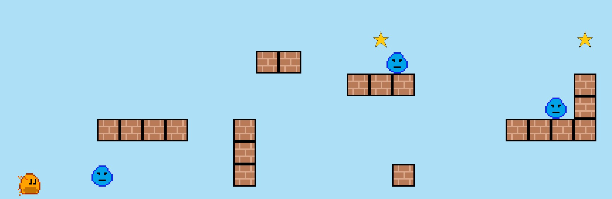
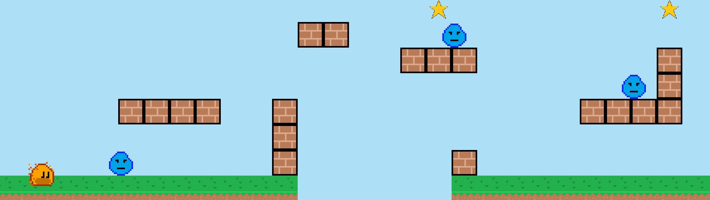

# 4. Adding the Remaining Components


## Star

The star is pretty simple.  It is just like the Platform block except we are going to add an effect
to make it pulse in size.  For the effect to look correct, we need to change the object's `Anchor`
to `center`.  This means we will need to adjust the position by half of the image size. For brevity,
I am going to add the whole class and explain the additional changes after.

```dart
import 'package:flame/collisions.dart';
import 'package:flame/components.dart';
import 'package:flame/effects.dart';
import 'package:flutter/material.dart';

import '../ember_quest.dart';

class Star extends SpriteComponent
    with HasGameRef<EmberQuestGame> {
  final Vector2 gridPosition;
  double xOffset;

  final Vector2 velocity = Vector2.zero();

  Star({
    required this.gridPosition,
    required this.xOffset,
  }) : super(size: Vector2.all(64), anchor: Anchor.center);

  @override
  Future<void> onLoad() async {
    final starImage = game.images.fromCache('star.png');
    sprite = Sprite(starImage);
    position = Vector2(
        (gridPosition.x * size.x) + xOffset + (size.x / 2),
        game.size.y - (gridPosition.y * size.y) - (size.y / 2),
    );
    add(RectangleHitbox()..collisionType = CollisionType.passive);
    add(
      SizeEffect.by(
        Vector2(-24, -24),
        EffectController(
          duration: .75,
          reverseDuration: .5,
          infinite: true,
          curve: Curves.easeOut,
        ),
      ),
    );
  }

  @override
  void update(double dt) {
    velocity.x = game.objectSpeed;
    position += velocity * dt;
    if (position.x < -size.x) removeFromParent();
    super.update(dt);
  }
}
```

So the only change between the Star and the Platform beyond the anchor is simply the following:

```dart
add(
    SizeEffect.by(
    Vector2(-24, -24),
    EffectController(
        duration: .75,
        reverseDuration: .5,
        infinite: true,
        curve: Curves.easeOut,
    ),
    ),
);
```

The `SizeEffect` is best explained by going to their [help
docs](../../flame/effects.md#sizeeffectby).  In short, we simply reduce the size of the star
by -24 pixels in both directions and we make it pulse infinitely using the `EffectController`.

Don't forget to add the star to your `lib/ember_quest.dart` file by doing:

```dart
case Star:
    add(Star(
        gridPosition: block.gridPosition,
        xOffset: xPositionOffset,
    ));
    break;
```

If you run your game, you should now see pulsing stars!


## Water Enemy

Now that we understand adding effects to our objects, let's do the same for the water drop enemy.
Open `lib/actors/water_enemy.dart` and add the following code:

```dart
import 'package:flame/collisions.dart';
import 'package:flame/components.dart';
import 'package:flame/effects.dart';

import '../ember_quest.dart';

class WaterEnemy extends SpriteAnimationComponent
    with HasGameRef<EmberQuestGame> {
  final Vector2 gridPosition;
  double xOffset;

  final Vector2 velocity = Vector2.zero();

  WaterEnemy({
    required this.gridPosition,
    required this.xOffset,
  }) : super(size: Vector2.all(64), anchor: Anchor.bottomLeft);

  @override
  Future<void> onLoad() async {
    animation = SpriteAnimation.fromFrameData(
      game.images.fromCache('water_enemy.png'),
      SpriteAnimationData.sequenced(
        amount: 2,
        textureSize: Vector2.all(16),
        stepTime: 0.70,
      ),
    );
    position = Vector2(
        (gridPosition.x * size.x) + xOffset + (size.x / 2),
        game.size.y - (gridPosition.y * size.y) - (size.y / 2),
    );
    add(RectangleHitbox()..collisionType = CollisionType.passive);
    add(
      MoveEffect.by(
        Vector2(-2 * size.x, 0),
        EffectController(
          duration: 3,
          alternate: true,
          infinite: true,
        ),
      ),
    );
  }

  @override
  void update(double dt) {
    velocity.x = game.objectSpeed;
    position += velocity * dt;
    if (position.x < -size.x) removeFromParent();
    super.update(dt);
  }
}

```

The water drop enemy is an animation just like Ember, so this class is extending the
`SpriteAnimationComponent` class but it uses all of the previous code we have used for the Star and
the Platform.  The only difference will be instead of the `SizeEffect`, we are going to use the
`MoveEffect`.  The best resource for information will be their [help
docs](../../flame/effects.md#sizeeffectby).  

In short, the `MoveEffect` will last for 3 seconds, alternate directions, and run infinitely.  It
will move our enemy to the left, 128 pixels (-2 x image width).  You may have noticed that in the
constructor, I set `Anchor` to `center`.  This was done just for the sake of making the calculations
easier but could have been left as `bottomLeft`.

Don't forget to add the water enemy to your `lib/ember_quest.dart` file by doing:

```dart
case WaterEnemy:
    add(WaterEnemy(
        gridPosition: block.gridPosition,
        xOffset: xPositionOffset,
    ));
    break;
```

If you run the game now, the Water Enemy should be displayed and moving!




## Ground Blocks

Finally, the last component that needs to be displayed is the Ground Block!  This component is more
complex than the others as we need to identify two times during a block's life cycle.

- When the block is added, if it is the last block in the segment, we need to update a global value
  as to its position.
- When the block is removed, if it was the first block in the segment, we need to randomly get the
  next segment to load.

So let's start with the basic class which is nothing more than a copy of the Platform Block.

```dart
import 'package:flame/collisions.dart';
import 'package:flame/components.dart';
import 'package:flutter/material.dart';

import '../ember_quest.dart';

class GroundBlock extends SpriteComponent with HasGameRef<EmberQuestGame> {
  final Vector2 gridPosition;
  double xOffset;

  final Vector2 velocity = Vector2.zero();

  GroundBlock({
    required this.gridPosition,
    required this.xOffset,
  }) : super(size: Vector2.all(64), anchor: Anchor.bottomLeft);

  @override
  Future<void> onLoad() async {
    final groundImage = game.images.fromCache('ground.png');
    sprite = Sprite(groundImage);
    position = Vector2((gridPosition.x * size.x) + xOffset,
        game.size.y - (gridPosition.y * size.y),
    );
    add(RectangleHitbox()..collisionType = CollisionType.passive);
  }

  @override
  void update(double dt) {
    velocity.x = game.objectSpeed;
    position += velocity * dt;
    super.update(dt);
  }
}
```

The first thing we will tackle is registering the block globally if it is the absolute last block to
be loaded.  To do this, add two new global variables in `lib/ember_quest.dart` called:

```dart
  late double lastBlockXPosition = 0.0;
  late UniqueKey lastBlockKey;
```

Declare the following variable at the top of your Ground Block class:

```dart
final UniqueKey _blockKey = UniqueKey();
```

Now in your Ground Block's `onLoad` method, add the following at the end of the method:

```dart
if (gridPosition.x == 9 && position.x > game.lastBlockXPosition) {
    game.lastBlockKey = _blockKey;
    game.lastBlockXPosition = position.x + size.x;
}
```

All that is happening is if this block is the 10th block (9 as the segment grid is 0 based) AND
this block's position is greater than the global `lastBlockXPosition`, set the global block key to be
this block's key and set the global `lastBlockXPosition` to be this blocks position plus the width of
the image (the anchor is bottom left and we want the next block to align right next to it).

Now we can address updating this information, so in the `update` method, add the following code:

```dart
  @override
  void update(double dt) {
    velocity.x = game.objectSpeed;
    position += velocity * dt;

    if (gridPosition.x == 9) {
      if (game.lastBlockKey == _blockKey) {
        game.lastBlockXPosition = position.x + size.x - 10;
      }
    }

    super.update(dt);
  }
```

`game.lastBlockXPosition` is being updated by the block's current x-axis position plus its width -
10 pixels.  This will cause a little overlap, but due to the potential variance in `dt` this
prevents gaps in the map as it loads while a player is moving.


### Loading the Next Random Segment

To load the next random segment, we will use the `Random()` function that is built-in to
`dart:math`.  The following line of code gets a random integer from 0 (inclusive) to the max number
in the passed parameter (exclusive).

```dart
Random().nextInt(segments.length),
```

Back in our Ground Block, we can now add the following to our 'update' method before
the other block we just added:

```dart
if (position.x < -size.x) {
  removeFromParent();
  if (gridPosition.x == 0) {
    game.loadGameSegments(
        Random().nextInt(segments.length), game.lastBlockXPosition);
  }
}
```

This simply extends the code that we have in our other objects, where once the block is off the
screen and if the block is the first block of the segment, we will call the `loadGameSegments`
method in our game class, get a random number between 0 and the number of segments and pass in the
offset.  If `Random()` or `segments.length` does not auto-import, you will need:

```dart
import 'dart:math';

import '../managers/segment_manager.dart';
```

So our full Ground Block class should look like this:

```dart
import 'dart:math';

import 'package:flame/collisions.dart';
import 'package:flame/components.dart';
import 'package:flutter/material.dart';

import '../ember_quest.dart';
import '../managers/segment_manager.dart';

class GroundBlock extends SpriteComponent with HasGameRef<EmberQuestGame> {
  final Vector2 gridPosition;
  double xOffset;
  
  final UniqueKey _blockKey = UniqueKey();
  final Vector2 velocity = Vector2.zero();

  GroundBlock({
    required this.gridPosition,
    required this.xOffset,
  }) : super(size: Vector2.all(64), anchor: Anchor.bottomLeft);

  @override
  Future<void> onLoad() async {
    final groundImage = game.images.fromCache('ground.png');
    sprite = Sprite(groundImage);
    position = Vector2((gridPosition.x * size.x) + xOffset,
        game.size.y - (gridPosition.y * size.y),
    );
    add(RectangleHitbox()..collisionType = CollisionType.passive);
    if (gridPosition.x == 9 && position.x > game.lastBlockXPosition) {
      game.lastBlockKey = _blockKey;
      game.lastBlockXPosition = position.x + size.x;
    }
  }

  @override
  void update(double dt) {
    velocity.x = game.objectSpeed;
    position += velocity * dt;

    if (position.x < -size.x) {
      removeFromParent();
      if (gridPosition.x == 0) {
        game.loadGameSegments(
            Random().nextInt(segments.length),
            game.lastBlockXPosition);
      }
    }
    if (gridPosition.x == 9) {
      if (game.lastBlockKey == _blockKey) {
        game.lastBlockXPosition = position.x + size.x - 10;
      }
    }

    super.update(dt);
  }
}

```

Finally, don't forget to add your Ground Block to `lib/ember_quest.dart` by adding the following:

```dart
case GroundBlock:
    add(GroundBlock(
        gridPosition: block.gridPosition,
        xOffset: xPositionOffset,
    ));
    break;
```

If you run your code, your game should now look like this:



You might say, but wait!  Ember is in the middle of the ground and that is correct because Ember's
`Anchor` is set to center.  This is ok and we will be addressing this in [](step_5.md) where we will
be adding movement and collisions to Ember!
