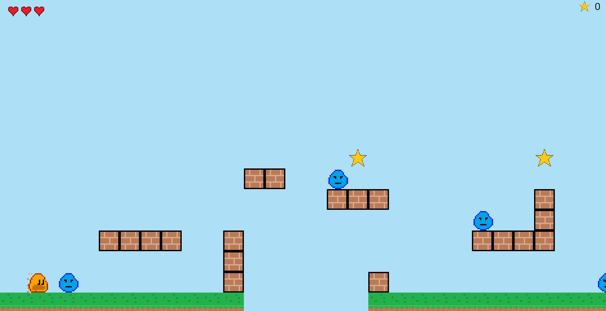

# 6. Adding the HUD


## Setting up the HUD

Now that the game is up and running, the rest of the code should come fairly easily.  To prepare for
the hud, we need to add some variables in `lib/ember_quest.dart`.  Add the following to the top of
the class:

```dart
int starsCollected = 0;
int health = 3;
```

Start by creating a folder called `lib/overlays`, and in that folder, create a component called
`heart.dart`.  This is going to be the health monitoring component in the upper left-hand corner of
the game.  Add the following code:

```dart
import 'package:ember_quest/ember_quest.dart';
import 'package:flame/components.dart';

enum HeartState {
  available,
  unavailable,
}

class HeartHealthComponent extends SpriteGroupComponent<HeartState>
    with HasGameRef<EmberQuestGame> {
  final int heartNumber;

  HeartHealthComponent({
    required this.heartNumber,
    required super.position,
    required super.size,
    super.scale,
    super.angle,
    super.anchor,
    super.priority,
  });

  @override
  Future<void> onLoad() async {
    await super.onLoad();
    final availableSprite = await game.loadSprite(
      'heart.png',
      srcSize: Vector2.all(32),
    );

    final unavailableSprite = await game.loadSprite(
      'heart_half.png',
      srcSize: Vector2.all(32),
    );

    sprites = {
      HeartState.available: availableSprite,
      HeartState.unavailable: unavailableSprite,
    };

    current = HeartState.available;
  }

  @override
  void update(double dt) {s
    if (game.health < heartNumber) {
      current = HeartState.unavailable;
    } else {
      current = HeartState.available;
    }
    super.update(dt);
  }
}

```

The `HeartHealthComponent` is just a [SpriteGroupComponent](../../flame/components.md#spritegroup)
that uses the heart images that were created early on.  The unique thing that is being done, is when
the component is created, it requires a `heartNumber`, so in the `update` method, we check to see if
the `game.health` is less than the `heartNumber` and if so, change the state of the component to
unavailable.

To put this all together, create `hud.dart` in the same folder and add the following code:

```dart
import 'package:flame/components.dart';
import 'package:flutter/material.dart';

import '../ember_quest.dart';
import 'heart.dart';

class Hud extends PositionComponent with HasGameRef<EmberQuestGame> {
  Hud({
    super.position,
    super.size,
    super.scale,
    super.angle,
    super.anchor,
    super.children,
    super.priority = 5,
  }) {
    positionType = PositionType.viewport;
  }

  late TextComponent _scoreTextComponent;

  @override
  Future<void>? onLoad() async {
    _scoreTextComponent = TextComponent(
      text: '${game.starsCollected}',
      textRenderer: TextPaint(
        style: const TextStyle(
          fontSize: 32,
          color: Color.fromRGBO(10, 10, 10, 1),
        ),
      ),
      anchor: Anchor.center,
      position: Vector2(game.size.x - 60, 20),
    );
    add(_scoreTextComponent);

    final starSprite = await game.loadSprite('star.png');
    add(
      SpriteComponent(
        sprite: starSprite,
        position: Vector2(game.size.x - 100, 20),
        size: Vector2.all(32),
        anchor: Anchor.center,
      ),
    );

    for (var i = 1; i <= game.health; i++) {
      final positionX = 40 * i;
      await add(
        HeartHealthComponent(
          heartNumber: i,
          position: Vector2(positionX.toDouble(), 20),
          size: Vector2.all(32),
        ),
      );
    }

    return super.onLoad();
  }

  @override
  void update(double dt) {
    _scoreTextComponent.text = '${game.starsCollected}';
    super.update(dt);
  }
}

```

In the `onLoad` method, you can see where we loop from 1 to the `game.health` amount, to create
the number of hearts necessary.  The last step is to add the hud to the game.

Go to 'lib/ember_quest.dart` and add the following code in the `initializeGame` method:

```dart
add(Hud());
```

If the auto-import did not occur, you will need to add:

```dart
import 'overlays/hud.dart';
```

If you run the game now, you should see:




## Updating the HUD Data

The last thing we need to do before closing out the HUD is to update the data.  To do this, we need
to open `lib/actors/ember.dart` and add the following code:

`onCollision`

```dart
if (other is Star) {
    other.removeFromParent();
    game.starsCollected++;
}
```

```dart
void hit() {
if (!hitByEnemy) {
    game.health--;
    hitByEnemy = true;
}
add(
    OpacityEffect.fadeOut(
    EffectController(
      alternate: true,
      duration: 0.1,
      repeatCount: 5,
    ),
    )..onComplete = () {
      hitByEnemy = false;
    },
);
}
```

If you run the game now, you will see that your health is updated and the stars are incremented as
appropriate.  Finally, in [](step_7), we will finish the game by adding the main menu and the
game-over menu.
