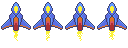

# Adding animations and depth

We now have something that looks more like a game, having graphics for our spaceship and being
able to directly control it.

But our game so far is too boring, the starship is just a static sprite and the background is
just a black screen.

In this step we will look at how to improve that, we will replace the static graphics of the player
with an animation and create a cool sense of depth and movement by adding a parallax to the
background of the game.

So lets start by adding the animation to the player ship! For that, we will something that we
call Sprite Animations, which is an animation that is composed by a collection of sprites, each
one representing one frame, and the animation effect is achieved by rendering one sprite after
the other over a time frame.

To better visualize this, this is the animation that we will be using, note how the image holds 4
individual images (or frames).



Flame provides us with a specialized classes to deal with such images: `SpriteAnimation` and its component
wrapper `SpriteAnimationComponent` and changing our `Player` component to be an animation is quite
simple, take a look at how the component will look like now:

```dart
class Player extends SpriteAnimationComponent
    with HasGameReference<SpaceShooterGame> {

  Player() : super(
    size: Vector2(100, 150),
    anchor: Anchor.center,
  );

  @override
  Future<void> onLoad() async {
    await super.onLoad();

    animation = await game.loadSpriteAnimation(
      'player.png',
      SpriteAnimationData.sequenced(
        amount: 4,
        stepTime: .2,
        textureSize: Vector2(32, 48),
      ),
    );

    position = game.size / 2;
  }

  // Other methods omitted
}
```

So lets break down the changes:

- First we changed our `Player` component to extend from `SpriteAnimationComponent` instead of
`SpriteComponent`
- In the `onLoad` method we are now using the `game.loadSpriteAnimation` helper instead of the
 `loadSprite` one, and setting the `animation` attribute with its returned value.

The `SpriteAnimationData` class might look complicated at first glance, but it is actually quite
simple, note how we used the `sequenced` constructor, which is a helper to load animation images
where the frames are already laid down in the sequence that they will play, then:

- `amount` defines how many frames the animation has, in this case `4`
- `stepTime` is the time in seconds that each frame will be rendered, before it gets replaced
with the next one.
- `textureSize` is the size in pixels which defines each frame of the image.

With all of this information, the `SpriteAnimationComponent` will now automatically play the
animation!

Now lets add some depth and energy to our game background. Of course there are many ways of
doing so, in this tutorial we will explore the idea of parallax scrolling. If you never heard
about it, it consist of a technique where background images move past the camera with different
speeds, this not only creates the sensation of depth but also improves the movement feeling
of the game a lot. If you want to read more about Parallax Scrolling, check this article
from [Wikipedia](https://en.wikipedia.org/wiki/Parallax_scrolling).

Flame provides classes to implement parallax scrolling out of the box, these classes are `Parallax` and
`ParallaxComponent`, so lets take a look at how we can add that new feature to the game:

```dart
import 'package:flame/components.dart';
import 'package:flame/events.dart';
import 'package:flame/game.dart';
import 'package:flame/input.dart';
import 'package:flame/parallax.dart';
import 'package:flutter/material.dart';

class SpaceShooterGame extends FlameGame with PanDetector {
  late Player player;

  @override
  Future<void> onLoad() async {
    final parallax = await loadParallaxComponent(
      [
        ParallaxImageData('stars_0.png'),
        ParallaxImageData('stars_1.png'),
        ParallaxImageData('stars_2.png'),
      ],
      baseVelocity: Vector2(0, -5),
      repeat: ImageRepeat.repeat,
      velocityMultiplierDelta: Vector2(0, 5),
    );
    add(parallax);

    player = Player();
    add(player);
  }

  @override
  void onPanUpdate(DragUpdateInfo info) {
    player.move(info.delta.global);
  }
}
```

Looking at the code above we notice that we are now using the `loadParallaxComponent` helper
method from the `FlameGame` class to directly load a `ParallaxComponent` and add it to our game.

The arguments used there are as follows:

- The first argument is a positional one, which should be a list of `ParallaxData`s. There are a
couple of types of `ParallaxData`s in Flame, in this tutorial we are using the `ParallaxImageData`
which describes a layer in the parallax scrolling effect that is an `image`. This list will tell
Flame about all the layers that we want in our parallax.
- `baseVelocity` is the base value for all the values, so by passing a `Vector2(0, -5)` to it
means that the slower of the layers will move at 0 pixels per second on the `x` axis and `-5`
pixels per second on the `y` axis.
- Finally `velocityMultiplierDelta` is a vector that is applied to the base value for each layer,
and in our example the multiplication rate is `5` on only the `y` axis.


Give it a try by running the game now, you will notice that it looks way more dynamic now, giving a
more convincing feeling to the player that the spaceship is really crossing the stars!

```{flutter-app}
:sources: ../tutorials/space_shooter/app
:page: step3
:show: popup code
```

[Next step: Adding bullets](./step_4.md)
