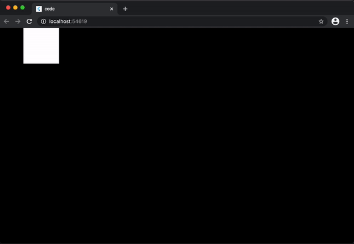

# Basic: Rendering a simple square on the screen

This tutorial will introduce you to:

 - `Game`: The basic class to build a game on, you will understand its structure and how to use it
 to build a simple game
 - `GameWidget`: The widget used to place your game on your Flutter widget tree
 - Basic rendering: You will get introduced to the basics of using the `Canvas` class from `dart:ui`
 which is the class that Flame uses for rendering your game.

All the code of this tutorial code can be found [here](./code) and is based on the Flame `1.0.0-rc8`
version.

By the end of this tutorial you will have built a simple game that renders a square bouncing on the
screen that will look like this:



## Building your first game

`Game` is the most basic class that you can use to build your game, it includes the necessary
methods for creating a basic game loop and methods for the lifecycle of a Flame game.

For more complex games, you will probably want to use `BaseGame`, which has a lot of utilities that
will make your life easier. We will cover that on later tutorials, for this one the `Game` class
will be enough for the concepts that you will learn here.

`GameWidget` is, like the name suggests, a Flutter widget that will run your game and place it
inside the Flutter widget tree.

As a first step, lets just get a Game instance running. For that, we will need to create our own
class that extends Flame's Game class, implement its methods, and pass an instance of that `Game` to
a `GameWidget`. Something like this:

```dart
import 'package:flutter/material.dart';
import 'package:flame/game.dart';

void main() {
  final myGame = MyGame();
  runApp(
    GameWidget(
      game: myGame,
    ),
  );
}

class MyGame extends Game {
  @override
  void update(double dt) { /* TODO */ }

  @override
  void render(Canvas canvas) { /* TODO */ }
}
```

That is it! If you run this, you will only see an empty black screen for now, but now we have the
bare-bones needed to start implementing our game.

Before going further, it is important to explain what those two methods mean.

Flame's `Game` class is an implementation of a Game Loop, which the basic structure on which most
games are built on. It is called a Game Loop because it really works as an infinite loop that will
continue to iterate as long as the game is running. The loop goes through the following steps:

 1. Take input from the player
 2. Process the logic for the next frame
 3. Render the frame.

In this tutorial we will focus on both step two and three.

To process the logic of the game, we use the `update` method, which always runs before the frame is
rendered. Update receives a single argument, a `double` value called `dt` (delta time), which is the
amount of seconds between the current iteration and the last one. This delta time is very important
since we use it to correctly calculate the speed of movement, animations and etc.

To render the frame, we use the `render` method, this method receives a single argument which is an
instance of a `dart:ui` `Canvas` class. With that instance we can basically render anything we want.
It is important to not have any game logic in this method, it should only contain render
instructions, any game logic should be put in the `update` method.

Now that we have a better understanding of how the game structure works, lets start to plan our
game.

So, lets think on what variables and data structure we would need. For that, lets recap what we are
building: A simple game where a square keeps bouncing forever from one side of the screen to the
other. Thinking about this, we will need:

 - A constant to tell us the speed of the square in logical pixels per second.
 - A variable to keep track of which direction the square is moving.
 - A structure to represent our square, which has a position and dimensions.

With that in mind, check the example below, note the comments for explanations on each code section.


```dart
class MyGame extends Game {
  // A constant speed, represented in logical pixels per second
  static const int squareSpeed = 400;

  // To represent our square we are using the Rect class from dart:ui
  // which is a handy class to represent this type of data. We will be
  // seeing other types of data classes in the future, but for this
  // example, Rect will do fine for us.
  late Rect squarePos;

  // To represent our direction, we will be using an int value, where 1 means
  // going to the right, and -1 going to the left, this may seems like a too much
  // simple way of representing a direction, and indeed it is, but this will
  // will work fine for our small example and will make more sense when we implement
  // the update method
  int squareDirection = 1;

  // The onLoad method is where all of the game initialization is supposed to go
  // For this example, you may think that this square could just be initialized on the field
  // declaration, and you are right, but for learning purposes and to present the life cycle method
  // for this example we will be initializing this field here.
  @override
  Future<void> onLoad() async {
    squarePos = Rect.fromLTWH(0, 0, 100, 100);
  }

  // Update and render omitted
}
```

Right, now we have all the data and variables we need to start implementing our game. For the next
step, lets draw our little square on the screen.

```dart
class MyGame extends Game {
  // BasicPalette is a help class from Flame, which provides default, pre-built instances
  // of Paint that can be used by your game
  static final squarePaint = BasicPalette.white.paint();

  // Update method omitted

  @override
  void render(Canvas canvas) {
    // Canvas is a class from dart:ui and is it responsible for all the rendering inside of Flame
    canvas.drawRect(squarePos, squarePaint);
  }
}
```

You may now be seeing a static white square being rendered on the top left corner of your screen,
which is not that impressive, so, to finish our example, lets add some movement to the game and
implement our update method:

```dart
  @override
  void update(double dt) {
    // Here we move our square by calculating our movement using
    // the iteration delta time and our speed variable and direction.
    // Note that the Rect class is immutable and the translate method returns a new Rect instance
    // for us, so we just re-assign it to our square variable.
    //
    // It is important to remember that the result of the execution of this method,
    // must be the game state (in our case our rect, speed and direction variables) updated to be
    // consistent of how it should be after the amount of time stored on the dt variable,
    // that way your game will always run smooth and consistent even when a FPS drop or peak happen.
    //
    // To illustrate this, if our square moves at 200 logical pixels per second, and half a second
    // has passed, our square should have moved 100 logical pixels on this iteration
    squarePos = squarePos.translate(squareSpeed * squareDirection * dt, 0);

    // This simple condition verifies if the square is going right, and has reached the end of the
    // screen and if so, we invert the direction.
    //
    // Note here that we have used the variable size, which is a variable provided
    // by the Game class which contains the size in logical pixels that the game is currently using.
    if (squareDirection == 1 && squarePos.right > size.x) {
      squareDirection = -1;
    // This does the same, but now checking the left direction
    } else if (squareDirection == -1 && squarePos.left < 0) {
      squareDirection = 1;
    }
  }
```

If we run our game again, we should see our square bouncing back and forth like we wanted from the
beginning.

And that is it for this basic tutorial, in which we have covered the basics of Flame, its basic
classes and some basic rendering. From that we can start to build more complex things and more
exciting games.
