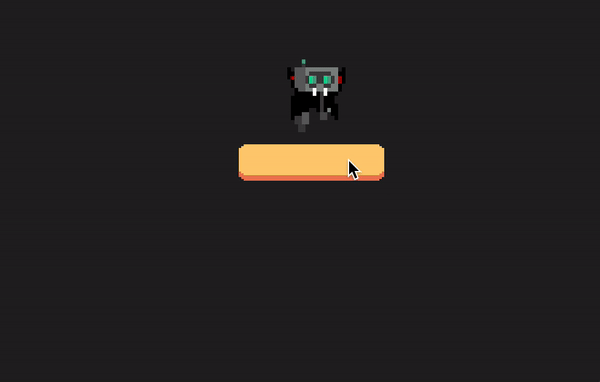
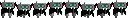

# Basic: Sprites, Animations and Gestures

This tutorial will introduce you to:

 - `Sprite`: Sprites are how we draw images, or portions of an image in Flame.
 - `SpriteAnimation`: SpriteAnimations are animations composed from sprites, where each sprite represents a frame.
 - Gesture input: Input is a crucial part of game development, on this tutorial you will learn how to use one of the most basic of them, the tap detector.

All the code of this tutorial code can be found [here](./code) and is based on the Flame `1.0.0-rc8` version.

By the end of this tutorial you will have built a simple game which renders a button which when pressed, makes a small vampire robot run, that will look like this:



## Sprite

Before starting coding our game, it is important to understand what sprites are and what they are used for.

Sprites are images, or a portion of an image loaded into the memory, which can then be used to render graphics on your game canvas.

Sprites can be (and usually are) bundled into single images, that is a very useful technique as it lowers the amount of I/O operations needed to load the game assets because it is faster to load 1 image of 10k than to load 10 images of 1kb each.

For example, on this tutorial, we will have a button that makes our robot run, this button needs two sprites, one for the unpressed button and another one for the pressed state, so we can have the following image:


This technique is often called sprite sheet.

## Animations

Animations is what gives 2D games life, Flame provides a handy class called `SpriteAnimation` which lets you create an animation out of an list of sprites. Animations usually have all its frame's sprite into a single image



Flame provides way for easily turning that sprite sheet into an animation, which we will see how in a few moments.

## Hands on

To get started lets just get a Flame `Game` instance running and just paste some bolierplate code on the editor, if you haven't yet checked our [first tutorial](https://github.com/flame-engine/flame/tree/main/tutorials/1_basic_square#building-your-first-game) to understand better this initial code.

```dart
void main() {
  final myGame = MyGame();
  runApp(
    GameWidget(
      game: myGame,
    ),
  );
}

class MyGame extends Game with TapDetector {

  @override
  void update(double dt) {
  }

  @override
  void render(Canvas canvas) {
  }

  @override
  Color backgroundColor() => const Color(0xFF222222);
}
```

Great, this will just gets us a plain, almost black screen, now with the game instance running lets first add our running robot on the screen:

```dart
class MyGame extends Game {
  late SpriteAnimation runningRobot;

  // Vector2 is a class from `package:vector_math/vector_math_64.dart` and is widely used
  // in Flame to represent vectors. Here we need two vectors, one to define where we are
  // going to draw our robot and another one to define its size
  final runningPosition = Vector2(240, 50);
  final runningSize = Vector2(48, 60);

  // Now, on the `onLoad` method, we need to load our animation, to do that we can use the
  // `loadSpriteAnimation` method, which is present on our game class
  @override
  Future<void> onLoad() async {
    runningRobot = await loadSpriteAnimation(
      'running.png',
      // `SpriteAnimationData` is a class used to tell Flame, how the animation spritesheet
      // is organized, here we are basically telling that our sprites is organized in a horizontal
      // sequence on the image, that there are 8 frames, each frame has time frame of `0.1` seconds
      // and finally, that each frame, is a sprite of 16x18 pixels
      SpriteAnimationData.sequenced(
        amount: 8,
        stepTime: 0.1,
        textureSize: Vector2(16, 18),
      ),
    );
  }

  @override
  void update(double dt) {
    // Here we just need to "hook" our animation into the game loop update method so it move
    // in its frame list
    runningRobot.update(dt);
  }

  @override
  void render(Canvas canvas) {
    // Since an animation is basically a list of sprites, to render it, we just need to get its
    // sprite and render it on our canvas
    runningRobot
        .getSprite()
        .render(canvas, position: runningPosition, size: runningSize);
  }

  @override
  Color backgroundColor() => const Color(0xFF222222);
}
```
